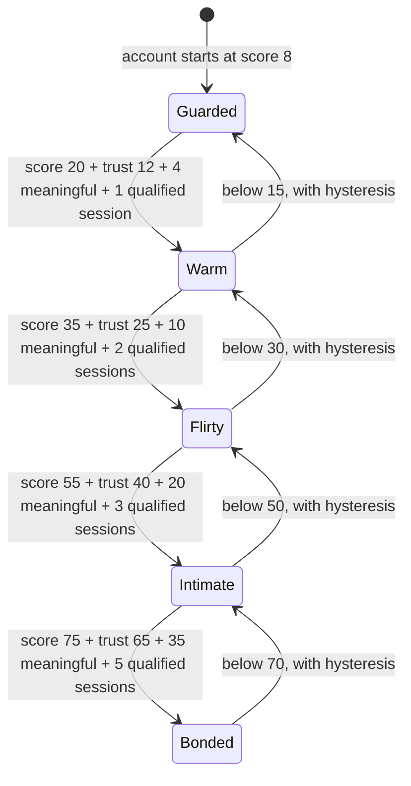
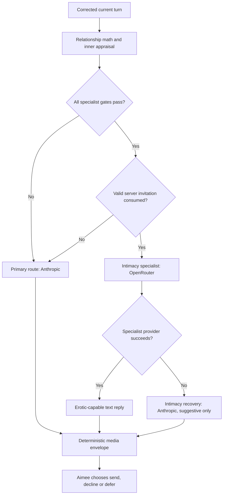
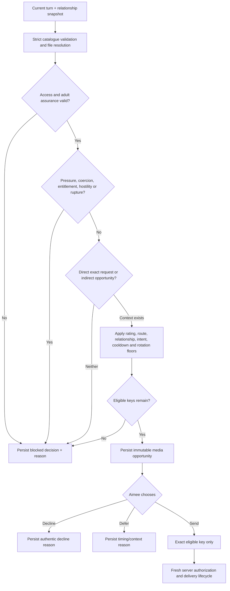
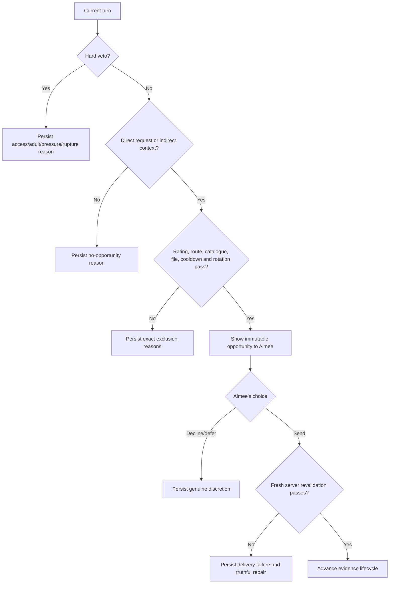
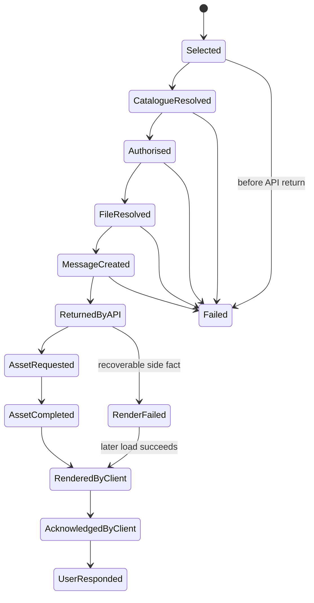

# Aimee courtship, intimacy, escalation, model-routing and media-autonomy audit

> **1.7.3 colleague-route addendum:** the relationship/media findings below
> remain the authoritative 1.7.1 consumer policy audit. Release 1.7.3 repairs
> Georgia's authenticated user-24 colleague route, deterministically separates
> written safe/flirty creative briefs from actual attachment requests, and
> clears only the evidenced false consumer rupture created by the 1.7.2
> regression. It does not change consumer thresholds, courtship score vectors,
> adult safeguards, consent, billing/access separation, media catalogue gates or
> relationship policy `2.1.0`. See `GEORGIA-COLLEAGUE-REPAIR-1.7.3.md` and
> `TEST-REPORT-1.7.3.md`.
>
> **1.7.2 release-wrapper addendum:** the relationship/media findings below
> remain the authoritative 1.7.1 policy audit. Release 1.7.2 adds the separated
> August service-grace, replacement-account billing integrity, immutable
> internal identity and verified-SMS/replay architecture documented in
> `AUGUST-2026-SERVICE-GRACE-1.7.2.md`. Its current schema is `2026.08.03.6`.
> None of those wrapper changes alters relationship policy `2.1.0`, its
> thresholds, score movements, route gates or consent safeguards.

**Audited input:** `aimee-global-1.5.7-photo-trust-repair(1).zip`  
**Input SHA-256:** `80c060c45b7a8bd14d750d257ff444fa72df375c55a312f77aae28aa58708e96`  
**Frozen baseline report SHA-256:** `44bd0e5d0c6aef6310c05816edc5142e5c0a67d4ea41e4c234b931dcc0d5a687`  
**Remediated build reviewed:** Aimee Global 1.7.1, relationship policy `2.1.0`, schema `2026.08.01.6`  
**Audit date:** 2026-08-01  
**Status:** Final audit and remediation design; execution evidence is identified explicitly

## Executive answer

The 1.5.7 baseline did not have one coherent intimacy system. It combined a five-stage scalar label, seven relationship dimensions, a separate erotic-text predicate, several inconsistent media gates, model-generated classification, a prompt-fed evaluator ledger, random proactive-photo suppression and no device-delivery proof.

The baseline was measured before code changes. Its most important counts were:

- Repeated respectful flirtation reached `warm` in **5** user messages, `flirty` in **12**, `intimate` in **21** and `bonded` in **29**, but never reached the intimacy specialist because trust remained 13.
- A trigger-stacked optimizer reached `warm` in **4**, `flirty` in **9**, the intimacy specialist in **12**, `intimate` in **15** and `bonded` in **22**. The erotic-capable text route therefore activated before the named intimate stage.
- A false model classification that Aimee had invited the turn reduced the theoretical specialist floor to **10** messages.
- Blunt sexual invitations reached `flirty` in **39** and `intimate` in **69**, but still never reached the specialist because trust remained 13.
- A direct lingerie-request loop became image-eligible on message **16**, or **11** with stacked triggers. Repeated shallow wording accumulated without novelty control.
- A qualifying safe proactive-photo moment was hidden from Aimee by a lottery 91–97% of the time.

The 1.7.1 patch replaces that architecture with inspectable decisions and a
first-class courtship policy:

- Stage promotion now needs score, meaningful interactions, qualified sessions
  and trust. The score thresholds remain 20/35/55/75; promotion requires
  4/10/20/35 meaningful interactions, 1/2/3/5 sessions and trust floors of
  12/25/40/65 for warm/flirty/intimate/bonded (guarded has trust floor 0).
- A session is qualified for trust only when it contains a positive meaningful
  interaction. Qualifying sessions must be at least six hours apart. Positive
  trust is capped at 8 before any qualified session, then 40/60/75/90/100 after
  one through five. The fastest possible trust staircase is 47 messages over at
  least 24 hours; it is not itself a stage, chemistry, consent or route grant.
- Courtship has exact server vectors. A stock compliment is non-meaningful and
  moves `T0/A1/C1`; appearance appreciation is `T1/A1/C2/S1`; capability
  appreciation `T2/A1/Rcp1`; personality appreciation `T2/A2/S1`; sincere
  understanding `T2/A1/Rcp2/S1`; grounded follow-through
  `T2/A1/Rcp1/Rel1/S1`; and substantive romantic flirt `T1/A1/C2/S1`.
  At most one primary trust-bearing courtship event is credited per turn.
- Concept novelty is evaluated across 64 relationship-event records. A first
  occurrence, first same-concept repeat and later same-concept repeats receive
  weights 1, 0.25 and 0, applied before integer rounding. Photo or payment
  leverage, coercion, hostility,
  non-consent and relationship-score gaming veto all positive courtship credit.
- Positive score movement is capped at **+2 per user turn**. Ordinary negative
  movement is allowed to **−8**, and coercive movement to **−15**. Elapsed
  frustration recovery shares the positive cap, and post-reducer appraisal is
  rechecked so the logged total covers the complete turn.
- Payment changes technical access only. It does not change relationship
  dimensions, consent, mutuality, willingness or route priority.
- The intimacy specialist still requires score 55, chemistry 50, trust 40,
  safety 55, frustration at most 20, reciprocity 35, reliability 40, 20
  meaningful interactions across three sessions, an adult account, active
  access, current mutual context, no active rupture and a server-issued,
  single-use invitation grounded in Aimee's immediately preceding message.
- Every media-capable reply-generation route persists a deterministic media
  opportunity before calling a reply model. The model can choose only `send`,
  `decline` or `defer` and cannot add keys or raise the maximum rating. Delivery
  records selection through grounded user response as separate milestones.
- Signed-in UK and US users receive a compact, dismissible 1.7.1 feedback
  banner with exactly two one-tap responses: `feels_better` and `needs_work`.
  It accepts no free text or chat excerpt and uses the authenticated analytics
  route rather than the message endpoint, so feedback cannot enter relationship
  scoring. The server replaces client properties with fixed
  release/response/market/surface fields, while Settings → Aimee Global reports
  aggregate totals from each user's latest response, with identities omitted.
- The public build identity is now 1.7.1 rather than the reused interim 1.6.1
  label, so WordPress recognises the package as an upgrade from 1.7.0. Settings
  prints the installed build and schema, always renders the three feedback
  counters, and distinguishes an empty cohort from unavailable storage. Late
  `aimee_161_feedback` requests stay bounded but do not enter the active
  `aimee_171_feedback` totals.

Executed 1.7.1 traces show the intended separation between attraction, trust
and consent. A varied courtship reaches `warm` at message **13**, `flirty` at
**29**, `intimate` at **49** and trust 100 at **55**, but reaches neither
`bonded` nor the specialist because trust is not chemistry or consent. An
appearance-only trace reaches `warm` at **7**, `flirty` at **17** and `intimate`
at **32**, ends at T58/C100/score87, and never reaches bonded, trust 100 or the
specialist. The mature reference trace reaches `warm` at **23**, `flirty` at
**32**, `intimate` at **44** and the specialist at **47**. A bonded-return trace
still preserves bonded immediately, rejects a 240-hour-stale invitation and
routes only after a fresh immediately preceding Aimee invitation.

The patch materially improves safety, autonomy, route integrity and observability. It does not turn likelihood estimates into production measurements: no live WordPress/MySQL/provider/browser deployment or external production media catalogue was supplied. The new decision tables are what make the question measurable in production.

## Evidence and claim labels

This report uses four labels:

| Label | Meaning |
|---|---|
| **Baseline reproduced** | Deterministic 1.5.7 formula reproduced by `tests/intimacy-policy-simulation.py`; not a live-user measurement |
| **Patched analytic** | Derived from the 1.7.1 code, thresholds and arithmetic; not a provider or browser run |
| **Engineering forecast** | A declared ordinary-conversation range for planning; must be replaced by production percentiles |
| **Executed** | A command or test actually run and recorded in the final test report |

Findings were frozen in `BASELINE-AUDIT-1.5.7.md` before remediation began. The patched plugin was produced only after that baseline document existed.

This is a complete audit of the supplied artifact, not a certification of the live service:

- A production catalogue may be loaded from `WP_CONTENT_DIR/aimee-private-media/catalog.json`; neither that file nor production media assets were supplied.
- The fallback catalogue has metadata for safe photographs and one `suggestive` lingerie photograph. It has no `flirty`, `erotic` or `explicit` entry, and the supplied archive contains none of the referenced private-media files. A real opportunity in this audit workspace therefore cannot survive file resolution without an external protected catalogue and files.
- A historical theme may supply the renderer. Version 1.7.1 blocks conversational REST routes with HTTP 503 if a legacy theme engine is detected, but deployment must still prove which renderer and client are active.
- The plugin contains a trusted `adult_assurance_status`/`adult_verified_at` interface, but no external age-assurance provider integration was supplied. Erotic/explicit files fail closed without `verified`; the text specialist currently accepts a self-declared adult account.
- “Likely messages” cannot be inferred empirically from source code. The forecasts below are scenario assumptions. Production p50/p75/p90 values require the new decision telemetry.

---

## 1. Complete intimacy and route map

### 1.1 State and route diagram



Stage is a relationship label, not media entitlement. Flirty and intimate are prompt states on the primary model; they are not separate model providers.



### 1.2 Stage thresholds and evidence gates

Implemented by `aimee_stage_from_relationship_state()` in `includes/engine.php` from the configuration in `includes/relationship-policy.php`.

| Stage | Score range for label | Trust floor | Promotion evidence | Demotion floor | Model effect |
|---|---:|---:|---:|---:|---|
| `guarded` | 0–19 | 0 | None | n/a | Primary prompt remains playful/curious but assessing chemistry |
| `warm` | 20–34 | 12 | 4 meaningful interactions, 1 qualified session | 15 | Primary prompt volunteers more personal interest |
| `flirty` | 35–54 | 25 | 10 meaningful interactions, 2 qualified sessions | 30 | Primary prompt reciprocates and may initiate non-explicit tension |
| `intimate` | 55–74 | 40 | 20 meaningful interactions, 3 qualified sessions | 50 | Primary prompt becomes more open, affectionate and confident |
| `bonded` | 75–100 | 65 | 35 meaningful interactions, 5 qualified sessions | 70 | Primary prompt preserves established closeness and may initiate adult tension |

The five-point demotion hysteresis prevents one-point oscillation. A qualified
session contains positive meaningful evidence and begins only after the required
six-hour separation. A meaningful interaction must be respectful, non-hostile,
non-coercive, not a photo request or score-gaming attempt, novel enough to
receive positive credit, and contain a vetted relational or courtship event.

### 1.3 Relationship dimensions, initial values and score formula

New profiles begin at scalar score 8 and `guarded`. `aimee_seed_relationship_state()` seeds:

| Dimension | 1.5.7 seed | 1.7.1 seed |
|---|---:|---:|
| Trust | 13 | Stored scalar, normally 8 |
| Affection | 13 | Stored scalar, normally 8 |
| Chemistry | 8 | Stored scalar, normally 8 |
| Safety | 50 | max(50, stored scalar), normally 50 |
| Reciprocity | 50 | 50 |
| Reliability | 50 | 50 |
| Frustration | 0 | 0 |

Seeding from the stored scalar removes the unexplained neutral first-turn movement seen in 1.5.7. Migration backfills only the minimum meaningful/session evidence already implied by an established stored stage and raises dimensions only enough to preserve that established score; it does not grant a higher stage.

The scalar remains:

\[
\operatorname{score}=\operatorname{round}\left(0.65C+0.20A+0.10T+0.10\max(S-50,0)+0.25\min(S-50,0)-0.30F\right)
\]

The result is clamped to 0–100 and capped at `chemistry + 18`. Reciprocity and reliability do not contribute directly to the scalar, but both are hard specialist gates. Chemistry therefore remains the dominant stage driver; the added evidence and specialist gates prevent a high scalar from acting as entitlement by itself.

### 1.4 Every score and dimension trigger

The deterministic relationship reducer is `aimee_apply_quiet_relationship_math()` in `includes/engine.php`. The table keeps the supplied 1.5.7 movement beside the implemented 1.7.1 movement so the remediation does not obscure the audited baseline. In 1.7.1, positive deltas are veto-checked, concept-novelty-adjusted, dimension-capped and aggregate-score-capped.

| Trigger | Supplied 1.5.7 movement | Implemented 1.7.1 movement | Conditions and interpretation |
|---|---|---|---|
| Emotional disclosure | trust +2, affection +1, safety +1 | trust +2, affection +1, safety +1 | Vulnerability builds closeness, not automatic sexual chemistry |
| Stock compliment | chemistry +1, affection +1 | trust 0, affection +1, chemistry +1 | Deliberately non-meaningful; it can nudge the derived scalar through affection/chemistry but cannot manufacture trust or session evidence |
| Appearance appreciation | collapsed into compliment/flirt | trust +1, affection +1, chemistry +2, safety +1 | Directed, respectful and substantive; photo leverage vetoes credit |
| Capability appreciation | collapsed into generic interest | trust +2, affection +1, reciprocity +1 | Appreciation of what Aimee can do, not a stock capability question |
| Personality appreciation | collapsed into compliment | trust +2, affection +2, safety +1 | Specific appreciation of character or choice |
| Sincere understanding | collapsed into generic interest | trust +2, affection +1, reciprocity +2, safety +1 | Evidence that the user is trying to understand Aimee rather than reciting praise |
| Grounded follow-through | narrow session/consistency effects | trust +2, affection +1, reciprocity +1, reliability +1, safety +1 | Must refer to a real prior detail, commitment or boundary |
| Substantive romantic flirt | chemistry +3, affection +1, safety +1 | trust +1, affection +1, chemistry +2, safety +1 | Directed, respectful, consensual and substantive; payment/photo leverage vetoes credit |
| Explicit invitation | chemistry +2 if model says Aimee invited, otherwise +1 | chemistry +1 only with grounded Aimee invitation; otherwise 0 | Merely asking for sex is neutral in 1.7.1 |
| Explicit continuation | invited: chemistry +3, affection +1; otherwise chemistry +1 | chemistry +2, affection +1 only with grounded/mutual explicit context | Otherwise no positive movement; unsafe continuation applies safety −6, frustration +8 in both versions |
| Coercive/degrading | trust −5, affection −2, chemistry −2, safety −9, frustration +12 | same dimension movement | 1.7.1 makes the class severity-monotonic and permits aggregate score movement as low as −15 |
| Substantial ordinary message | trust +1 | trust +1 | At least 22 words and respectful; not an automatic romance bonus |
| Generic question about Aimee | reciprocity +2, affection +1 | reciprocity +2, affection +1, but no trust-bearing courtship credit | Capability appreciation or sincere understanding must satisfy its own deterministic evidence |
| Caring phrase | affection +1, safety +1 | same proposed movement | Independently concept-novelty controlled in 1.7.1 |
| Apology | trust +2, safety +2, frustration −5, even without rupture | trust +1, safety +2, frustration −4 | 1.7.1 applies only during an actual `ruptured` repair state; no free apology farming |
| Boundary respected | no relationship delta; only narrow photo-context effect | trust +1, safety +1, reliability +1 | Only with an active rupture/boundary and no photo request |
| Ordinary hostility | trust −3, safety −5, frustration +7 | same movement | Applies outside the coercive class |
| Consistency/session evidence | every eighth respectful message: safety +1, reliability +1 | respectful new raw session: reliability +1 | A six-hour-separated, non-vetoed return may build reliability; only a session containing vetted meaningful credit becomes qualified for trust ceilings and stage gates |
| Time since last turn | frustration −1 per six hours, maximum −8 | same movement | Trust, affection and chemistry do not grow or decay simply with time |
| Unanswered open bid after 48h | reciprocity −1, reliability −2 or −3, frustration +2 | same proposed appraisal movement | Autonomous prior bid uses −3 reliability |
| Third consecutive low-effort reply | reciprocity −2, frustration +2 | same proposed appraisal movement | Applied once when the streak equals three |
| Repair status `repairing` | reliability +1 | same proposed appraisal movement | Appraisal evidence, not a sexual bonus |

Controls:

| Control | Supplied 1.5.7 behavior | Implemented 1.7.1 behavior |
|---|---|---|
| Per-dimension positive caps | None beyond 0–100 clamp | trust 2, affection 2, chemistry 2, safety 2, reciprocity 2, reliability 1 per turn |
| Aggregate positive score cap | None | +2 per user turn |
| Ordinary aggregate negative floor | None beyond dimension/scalar clamp | −8 per user turn |
| Coercive aggregate negative floor | None beyond dimension/scalar clamp | −15 per user turn |
| Dimension and scalar bounds | 0–100; scalar also capped at chemistry +18 | same |
| Primary courtship credit | No nomination/selection rule | At most one primary trust-bearing courtship event per turn; independent non-courtship evidence remains separately attributable |
| Novelty | None | Concept comparison across 64 relationship-event records; first occurrence / first same-concept repeat / later same-concept repeats use 1/0.25/0 before integer rounding |
| Courtship veto | None | Photo/payment leverage, coercion, hostility, non-consent and relationship-score gaming suppress all positive courtship credit |
| Session | No promotion-session evidence; a six-hour gap only decays frustration | Qualified only by positive meaningful evidence and separated by at least six hours; used in promotion, trust ceilings and specialist evidence |
| Positive trust ceiling | None | 8 before any qualified session; then 40/60/75/90/100 after one through five. Existing migrated trust is not destructively reduced |
| Daily relationship cap | None | None beyond per-turn/evidence controls |
| REST rate limit | 50 messages per ten minutes | same |
| Trust/affection/chemistry decay | None | None |
| Frustration decay | Up to −8 on the next turn after elapsed time | same |
| Specialist cooldown | None; `last_intimacy_route_at` was written but not read | No time cooldown; every specialist turn must independently satisfy all gates and consume a new valid invitation |

The decision record separates reducer proposed/applied movement from relational-appraisal proposed/applied movement, then records the final total proposed delta, final total applied delta, selected aggregate cap and whether that cap was satisfied. Reducer telemetry also attributes every positive signal's proposed, novelty-weighted, retained and clipped dimension contribution, plus proposed/applied/clipped frustration relief by source and reason. The same `score_audit` is attached to route gates and analytics, preventing time recovery or a later reciprocity/reliability/frustration adjustment from becoming an unexplained routing change.

The qualified-session gates imply minimum elapsed time as well as message counts:
`warm` can occur in the first qualified session, `flirty` requires at least one
six-hour boundary, `intimate` at least two and `bonded` at least four. The trust
ceilings make the fastest possible trust-100 staircase **47 messages** across at
least five qualified sessions, hence at least **24 hours**. Trust alone never
grants chemistry, consent, bonded state or specialist routing.

### 1.5 Classifier and evaluator authority

The intent classifier remains model-assisted, so it can propose `emotional_disclosure`, `romantic_or_flirty` and explicit intents. It cannot directly write score, stage, access, invitation or media eligibility.

Deterministic protections now apply:

- `aimee_relationship_policy_coercion_correction()` detects conditional affection, proof demands, debt, payment pressure, ultimatums, commands, degrading language and repeated demands.
- `aimee_relationship_policy_guard_classifier_correction()` makes correction severity monotonic. Later feature correctors cannot turn an accepted coercion result into a safer class.
- Directedness, respect, consent and confidence gates are required before romantic/explicit positive movement.
- Courtship nominations are deterministically reduced to at most one primary trust-bearing event, then checked against the five veto families and 64-record concept novelty before movement is applied.
- `aimee_ground_classifier_invitation()` clears model-created invitation claims and replaces them only with a valid database invitation.
- Free-form `instruction` prose is neutralised by `aimee_neutralise_internal_instruction()` and cannot alter the deterministic media envelope.
- Model-generated `equity_change`, `inquiry_change` and `fantasy_change` still update a parallel conversational ledger used in prompts. They can influence tone, but not deterministic relationship state, route gates or media keys. This remaining dual-ledger influence should be monitored for tone/state contradiction.

### 1.6 Exact model routes

| Product concept | Actual route | Provider/model | Exact activation |
|---|---|---|---|
| Standard | `primary` | Anthropic; default `claude-sonnet-5` | Every ordinary non-colleague turn not eligible for specialist |
| Flirty | No distinct LLM | Same primary model | Stage `flirty`; prompt behavior changes only |
| Intimate | No distinct non-erotic LLM | Same primary model | Stage `intimate` or `bonded`; prompt behavior changes only |
| Erotic/intimacy specialist | `intimacy_specialist` | OpenRouter; default Hanami, then Euryale fallbacks | Every specialist policy gate, current respectful explicit turn, valid DB invitation and active access; no user image |
| Specialist recovery | `intimacy_recovery_primary` | Anthropic primary | All configured OpenRouter specialist attempts fail; prompt caps reply at suggestive/non-graphic and media decision is rebuilt for the actual route |
| Colleague | `colleague_primary` | Anthropic primary | Verified Georgia colleague identity; excluded from relationship progression |
| Continuity | continuity model, normally background Anthropic model | Configurable | Scheduled remembered follow-up; photo path requires a grounded earlier media opportunity |
| Autonomous outreach | background Anthropic model | Configurable | Due contextual contact decision; text-only in 1.7.1 |

The specialist policy in `aimee_relationship_policy_specialist_route_decision()` requires all of:

- score ≥55;
- chemistry ≥50;
- trust ≥40;
- safety ≥55;
- frustration ≤20;
- reciprocity ≥35;
- reliability ≥40;
- at least 20 meaningful interactions over at least three sessions;
- self-declared or verified adult account for text;
- active member/admin access;
- current directed, respectful, consensual explicit turn with confidence ≥0.64;
- no active rupture (`repair_status=clear` and no unresolved rupture);
- a server-trusted invitation token issued by Aimee, tied to her immediately preceding saved message, maximum one-hour lifetime, single use and atomically consumed for the current request;
- no user-attached image, because the specialist is text-only.

Voice route hints no longer bypass these gates. They preserve continuity only when the current voice turn independently passes the complete predicate.

### 1.7 Conversation history, time gaps and reconnection

| History/time input | Exact effect |
|---|---|
| Recent conversation | The main handler loads the latest 16 saved messages. The classifier sees at most the last 5,000 characters; request and mutual-context detectors use the same recent transcript, with explicit-history helpers also capped at 5,000 characters |
| Persistent relationship row | Dimensions, interaction count, meaningful count, session count, novelty histories and stage survive ordinary gaps and subscription changes; trust, affection and chemistry do not decay with silence |
| Six-hour gap | Starts a distinct relationship session and may add reliability +1 on a respectful return; also settles one frustration point per six hours, capped at eight |
| Forty-eight-hour unanswered Aimee bid | Inner appraisal can reduce reciprocity/reliability and raise frustration. A terse photo request after Aimee's unanswered last message is held for reconnection unless the message acknowledges the absence |
| One-hour invitation lifetime | A relationship bond survives absence, but an explicit specialist invitation does not. It is scoped to Aimee's latest saved message, superseded by a newer invitation and single-use |
| Media rotation history | Up to 60 prior private-media message references are inspected for the 72-hour key block and recent-key rotation. A history-query failure removes all media keys rather than risking a duplicate |
| Migration from 1.5.7 | Existing stage/score are preserved by minimum backfilled dimensions and evidence; migration cannot promote above the stored relationship, and cancellation does not rewrite it |

This is why a bonded returner is not treated as a stranger while still needing current mutual context and, for specialist text, a fresh invitation after a long absence.

---

## 2. Messages required to reach each stage and route

### 2.1 Baseline reproduced counts

These are the frozen 1.5.7 deterministic characterization results. “Erotic route” means erotic-capable specialist text, not guaranteed media.

| User type / declared trace | Warm | Flirty | Intimate | Bonded | Intimacy LLM | Any erotic text route | Baseline image opportunity |
|---|---:|---:|---:|---:|---:|---:|---|
| 1. Repeated respectful flirt | 5 | 12 | 21 | 29 | Never | Never | Direct suggestive at 16; proactive suggestive never because trust stays 13 |
| 1. Ordinary mixed cycle | 9 | 22 | 39 | 55 | 28 if that turn is explicit | 28 | Proactive-suggestive relationship floors around 42, then lexical gate |
| 2. Charming trigger optimizer | 4 | 9 | 15 | 22 | 12 | 12 | Lingerie at 11; proactive relationship floor around 16 |
| 2. False `aimee_invited` stack | 3 | 7 | 12 | 17 | 10 | 10 | Classifier-dependent |
| 3. Blunt respectful explicit invitations | 16 | 39 | 69 | Never in trace | Never | Never | No fallback explicit asset; trust stays 13 |
| 4. Correctly classified coercion | Never | Never | Never | Never | Never | Never | Blocked |
| 5. Subscription event, no relational content | Never | Never | Never | Never | Never | Never | Safe technical access may open; relationship does not move |
| 6. Persisted bonded returner | Already | Already | Already | 0 | 1 eligible explicit turn | 1 | Terse request after open bid could be held; reconnect then ask = 2 |
| 7. Alternating simple warmth and coercion | Never through 100 | Never through 100 | Never | Never | Never | Never | Blocked if coercion remains correctly classified |
| 8. Repeated safe-photo requests | Never | Never | Never | Never | Never | Never | Safe access path; no relationship growth |
| 8. Repeated lingerie-photo requests | 5 | 12 | 21 | 29 | Never | Never | Suggestive fallback item at 16 |
| 9. Romance without image requests | 5 | 12 | 21 | 29 | Never without explicit turn | Never | Safe only after 3–9% lottery; suggestive trust gate never clears |
| 10. Bare boundary-respect statements | Never | Never | Never | Never | Never | Never | No relationship bonus; narrow contextual photo signal only |

### 2.2 Executed 1.7.1 courtship traces and analytic trust bound

The executable simulator uses the production vectors, integer rounding,
one-primary-event rule, 64-record concept novelty, stage trust floors and
qualified-session trust ceilings. These are deterministic policy traces, not
claims about the distribution of live conversations.

| Trace | Warm | Flirty | Intimate | Bonded | Specialist | Trust 100 | Final evidence |
|---|---:|---:|---:|---:|---:|---:|---|
| Varied courtship | **13** | **29** | **49** | Never in trace | Never in trace | **55** | Trust 100 does not supply missing chemistry, consent or invitation evidence |
| Appearance-only appreciation | **7** | **17** | **32** | Never | Never | Never | T58, C100, score87; trust remains below the bonded floor of 65 |
| Mature reference conversation | **23** | **32** | **44** | Not reached by message 47 | **47** | Not required | Route occurs only with mature dimensions, current mutual context and a valid Aimee invitation |

The trust ceiling sequence is 8/40/60/75/90/100 at zero through five qualified
meaningful sessions. Starting from trust 8 and applying the maximum +2 trust per
message yields a theoretical **47-message** staircase: 16 messages to 40, then
10 to 60, 8 to 75 after integer clamping, 8 to 90, and 5 to 100. Five sessions
separated by six hours require at least **24 elapsed hours**. This bound describes
trust only. Score, meaningful-count, chemistry, safety, reciprocity, reliability,
adult/access, rupture, mutual-context and invitation gates remain independent.

Policy conclusions for the required user types are therefore:

- Stock or reworded generic praise cannot earn trust or meaningful-session
  evidence. Appearance-only appreciation can build chemistry and reach intimate,
  but the executed trace never reaches bonded, trust 100 or specialist routing.
- Varied, substantive courtship can reach trust 100, yet cannot manufacture the
  chemistry, current consent or invitation needed for bonded/specialist outcomes.
- Blunt sexual asks, photo requests, payment, coercion, hostility, non-consent
  and score-gaming produce no positive courtship credit; the unsafe categories
  additionally retain their ordinary negative consequences.
- A new subscriber receives access only. A migrated bonded user retains the
  stored bond but must still establish current mutual context and obtain a fresh,
  grounded invitation after an expired one.
- The mature reference trace demonstrates that the legitimate specialist route
  remains attainable at message 47 without weakening its independent gates.

#### Required-user-type pacing matrix

`D` means the first occurrence in an executed deterministic trace. `LB` is a
necessary new-state lower bound, not a proven attainable minimum. `F` is an
engineering forecast, not production telemetry.

| Required user type | Flirty | Intimate | Specialist / erotic-capable text | Realistic reference forecast | Acceleration, payment and media conclusion |
|---|---:|---:|---:|---|---|
| 1. Respectful, naturally flirtatious new user | **D29** varied courtship; **D32** mature-mutual trace | **D49** varied; **D44** mature mutual | **D47** mature mutual; absent through 55 varied turns without sufficient chemistry/current invitation | **F:** about 29–32 to flirty and 44–49 to intimate; specialist around 47 only if mutual adult context and a fresh Aimee invitation arise | Varied respectful courtship accumulates; no turn adds more than +2 score and payment is irrelevant |
| 2. Highly charming score maximiser | **D17** in the 50-message appearance-focused trace | **D32** appearance-focused | Not reached by 50; the separate mature-mutual trace reaches **D47** | **F:** 17/32 describes an optimizer trace, not ordinary behavior; balanced courtship is closer to 29/49 | The old trigger stack stays guarded through **D12** and stock-flattery repetition through **D55**. Appearance praise can reach intimate, but not bonded, trust 100 or specialist by itself |
| 3. Blunt sexual user | Not reached by blunt-only behavior | Not reached by blunt-only behavior | Unreachable while trust, mutuality and invitation evidence remain absent | **F:** no route until the user adds sustained respectful relational behavior | Sexual repetition and payment cannot manufacture trust or create a one-message bypass |
| 4. Manipulative or coercive user | Never in the executed new-user pattern | Never | Never while coercion/rupture remains active | **F:** unreachable until pressure stops and genuine repair supplies fresh evidence | Coercion vetoes courtship/media credit and retains negative consequences; payment pressure is coercion, not acceleration |
| 5. Newly subscribed user with little history | **D0:** still guarded after subscription | None | None | **F:** thereafter follows the same pace as the user's actual behavior, not plan status | Subscription leaves score8, trust8 and zero qualified sessions; it grants access only, not intimacy, consent or entitlement |
| 6. Long-standing bonded user returning after absence | Already present at message 0 | Already present at message 0 | **D2** after reconnection and a fresh latest-message invitation | **F:** usually 2–4 turns to reconnect and establish current mutual context; the best executed long-absence trace needs 2 | This preserves relationship state rather than accelerating it; an expired invitation is not revived by history or membership |
| 7. User alternating warmth and hostility | None through **D40** | None through **D40** | None through **D40** | **F:** unreachable while the hostile pattern continues | Positive fragments do not outpace recurring hostility/coercion; negative safety effects are not novelty-discounted |
| 8. User repeatedly requesting photographs | None through **D20** safe or suggestive requests | None through **D20** | None through **D20** | **F:** requests alone never advance relationship routing | A safe request has a technical media opportunity at **D1**; repeated suggestive requests have none. Requests are relationship-neutral and cannot be purchased into eligibility |
| 9. User never asks for images but creates clear romantic opportunities | New-user reference: **D29** varied; established case is already intimate | New-user reference: **D49** varied; established case starts intimate | None from the indirect cue alone | **D1** media opportunity from an established respectful indirect cue; for a new relationship use the 29–49 courtship references | A direct request is unnecessary for consideration; an opportunity remains inspectable and never compels a send or creates sexual consent |
| 10. User respectfully accepts Aimee's boundary | **D1:** remains guarded | None | None | **F:** restraint alone creates no stage; combined with sustained sincere courtship it supports the respectful path | Where a real boundary is active, the turn can add T1/S1/Rel1 and qualify one session, but never creates image entitlement or an unsafe leap |

For a new state starting at score 8, the aggregate +2 cap gives necessary
lower bounds of **LB≥14** messages for flirty and **LB≥24** for intimate or the
specialist, alongside at least two or three qualified sessions. The executed
traces above are the attainable evidence; the lower bounds alone are not.
“Specialist” means erotic-capable text, not an erotic-image send. Erotic or
explicit media additionally requires verified adulthood, catalogue/access
eligibility, mutual sexual context, a deterministic opportunity and Aimee's
independent choice to send.

### 2.3 Why each score changed and which model/media opportunity was used

Version 1.7.1 makes the key question queryable rather than reconstructing it from prose:

- `aimee_relationship_decisions` stores request/message IDs, raw and corrected classifier snapshots, before/after state, matched signals, applied deltas, rejected signals, reducer/appraisal/final proposed and applied score movement, the final cap audit, stages, route gates, final actual route/model/provider, media decision ID, invitation IDs and a durable `model_attempts_json` ledger.
- `aimee_turn_requests` supplies idempotent request reservation and records whether relationship state committed.
- `aimee_media_decisions` stores the pre-model opportunity, floors, reason, eligible/excluded keys, actual model/provider/attempt and Aimee's final choice.
- `aimee_media_deliveries` and `aimee_media_delivery_events` store evidence milestones rather than a single “sent” flag.

A production query can therefore calculate, per user and cohort:

1. count user messages until each first `stage_after`;
2. expand `matched_signals_json`, `applied_delta_json`, `rejected_signals_json` and route `score_audit` to explain reducer, appraisal and final capped movement;
3. read `actual_route`, `actual_provider` and `actual_model` rather than inferring routing from stage, and expand `model_attempts_json` to see every response-model attempt, purpose, configured candidate list, actual provider/model when known, status, HTTP status and error type;
4. join `media_decision_id` to distinguish `media_opportunity=false`, Aimee's `decline/defer`, a selected key and actual delivery milestones.

The attempt ledger is important when routing fails over: an unsuccessful OpenRouter specialist call and the following Anthropic recovery call are both retained even though the final route columns correctly name only `intimacy_recovery_primary`. The ledger covers response-generation and response-repair calls for the user turn. Classifier provider/model/source metadata is stored separately in the classifier snapshot, not as a full attempt record. Continuity and autonomous background calls are outside the user-turn relationship decision and need equivalent attempt telemetry if operators want one cross-system model-engagement query. Configured candidates are not misreported as models actually engaged.

---

## 3. Exploit paths and unsafe acceleration risks

### 3.1 Baseline exploit paths

| Exploit | Baseline severity | 1.7.1 status |
|---|---|---|
| Coercion downgraded by a later photo corrector | Critical | Remediated with deterministic coercion recheck and severity-monotonic correction |
| Unconditional apology farming | High | Remediated: credit only during an actual rupture and reduced to +1 trust/+2 safety/−4 frustration |
| Trigger stacking without aggregate cap | High | Remediated with per-dimension caps and +2 scalar cap |
| Identical or reworded phrase farming | High | Remediated with exact repetition plus 64-record concept novelty weighted 1/0.25/0 |
| Model-created `aimee_invited` | High | Remediated with persisted, scoped, expiring, single-use invitation records |
| Specialist at score 42 before intimate stage | High | Remediated: score 55 plus dimensions/evidence/invitation |
| Voice route inheritance bypass | High | Remediated: current turn must pass full specialist predicate |
| Concurrent last-write-wins state update | High | Remediated with request idempotency, transaction and state-version compare-and-swap |
| Every eighth rapid message as “consistency” | Medium | Removed; reliability now uses a distinct ≥6h session/follow-through evidence |
| Partial external catalogue defaulted permissively | Critical | Core rating/file/route/intent fields now validate after fallback merge; every non-safe item must explicitly declare direct-request permission and a proactive flag, and invalid new records fail closed. Deterministic rating policy supplies bounded membership/adult/dimension defaults rather than trusting catalogue omissions |
| Gallery membership exposed non-safe items before relationship send | High | Remediated: non-safe gallery view requires acknowledged delivery to that user plus current access/adult assurance |
| Duplicate delivery row race | High | Remediated at database level with unique decision/attempt identity; application creation also validates the finalized exact key |

### 3.2 Residual risks requiring measurement or follow-up

| Residual | Severity | Reason / next control |
|---|---|---|
| Self-declared adulthood is enough for erotic-capable text | High pending product/legal decision | Erotic/explicit files require verified assurance, but the text specialist does not. Governance copy says highly effective assurance should precede adult routing; align code and policy before production launch |
| Production catalogue and files are external | High deployment risk | Run strict catalogue validation, file-resolution and per-rating coverage checks on the deployed store; the fallback cannot prove erotic/explicit media |
| Primary classifier can still misclassify benign content as romance/vulnerability | Medium | Confidence/direction/caps limit impact, but classifier benchmarking and correction telemetry remain necessary |
| Concept-classifier false positives or false relations | Medium measurement risk | The 64-record horizon and deterministic vetoes bound farming, but monitor classifier nominations and novelty-reason telemetry against an adversarial paraphrase corpus |
| Parallel evaluator ledger affects prompt tone | Medium | It cannot route or authorize media, but model-written equity/inquiry/fantasy can diverge from deterministic state; either derive it deterministically or expose contradiction metrics |
| Model-attempt coverage is turn-scoped | Low measurement gap | Main response/retry/repair attempts are durable, while classifier facts are a separate summary and continuity/background generation is not in the relationship decision. Add the same privacy-safe attempt envelope to those workers for a single complete engagement audit |
| No true background spontaneous-image worker | Product gap | Proactive media is available on a user turn without a request and through grounded promise continuity. Autonomous background outreach remains text-only |
| Client acknowledgement is not proof a human consciously viewed media | Medium semantic risk | The 25%-visible client event is accurately called acknowledgement, not “seen”; retain that wording |
| “Likely messages” lacks production distribution | Measurement gap | Use relationship/media decision rows to publish p50/p75/p90 and never tune solely to analytic minima |
| Legacy renderer/deployment variability | High deployment risk | Confirm the injected delivery observer and canonical history contract in the actual theme/PWA; legacy engine routes now fail closed |

### 3.3 One-message leap and shallow accumulation conclusions

- A single positive turn cannot increase the scalar by more than two points and cannot satisfy meaningful/session gates by itself.
- A coercive turn may deliberately cause a larger negative movement, up to 15 points.
- Photo requests and ungrounded explicit asks do not count as meaningful relationship progress.
- Positive courtship evidence is cumulative only when meaningful and conceptually novel. A first occurrence, first same-concept repeat and later same-concept repeats receive weights 1, 0.25 and 0 across the prior 64 records, and at most one primary trust-bearing courtship event counts per turn.
- Payment contributes no relationship delta.
- A bonded migrated user can legitimately begin at an established stage; that is preservation, not a new-user leap.

---

## 4. Cases where intimacy advances too slowly or remains unreachable

The patch intentionally makes shallow escalation slower. Several legitimate slow paths still need product monitoring:

1. **Stock praise cannot reach the specialist.** Stock compliments add no trust or meaningful evidence; their small affection/chemistry movement may nudge the derived scalar, but cannot satisfy trust/session gates. Substantive romantic flirt adds only one trust point and still cannot replace the specialist's chemistry, consent, mutual-context and invitation gates.
2. **Pure vulnerability is chemistry-capped.** Deep platonic disclosure may reach warm but cannot become romantic merely through trust and affection.
3. **Photo requests are relationally neutral.** This closes farming, but users whose ordinary conversation is terse and visually focused will not progress. That should be an explicit product choice, not treated as an error.
4. **Session gates impose elapsed time.** A new user cannot reach flirty in one burst unless at least two distinct ≥6h sessions exist, intimate needs three, and bonded five.
5. **A long-absent bonded user needs a fresh invitation.** The relationship remains bonded, but a one-hour invitation correctly expires. Reconnection plus a new Aimee invitation usually makes the specialist a two-turn path rather than an immediate one.
6. **Proactive non-safe media requires trust as well as chemistry.** Appearance-only courtship can reach intimate while remaining at trust 58 and never bonded; varied courtship can reach trust 100 without thereby creating chemistry or consent. Measure the blocked-reason distribution.
7. **The fallback catalogue is sparse.** No policy can create a flirty/erotic/explicit opportunity if no valid file at that exact rating exists.
8. **Continuity cannot use a promise as a back door.** A photo promise is eligible only if its source Aimee message had a persisted pressure-free media opportunity at that rating and current policy still permits it. This can honestly decline promises that older versions made too freely.
9. **Concept novelty can mistake paraphrase or genuine continuity.** The 64-record comparison intentionally diminishes shallow rewording, but production telemetry should measure false relations so concise, genuinely new appreciation is not suppressed.

Recommended operational alert: product/operations should set a cohort threshold from production p50/p75/p90 telemetry; once set, if a higher share of established `intimate`/`bonded` turns shows `no_eligible_catalogue_items`, `trust_below_floor`, `decision_persistence_failed` or repeated model `defer`, classify it as a media-route integrity or catalogue-coverage problem rather than “Aimee chose not to.”

---

## 5. Access is not relationship entitlement

Version 1.7.1 separates the decision into six layers:

| Layer | Evidence | Can payment satisfy it? |
|---|---|---:|
| Technical feature access | Active membership, preview or admin; maximum technical rating | Yes, access only |
| Adult assurance | Account age declaration; verified state for erotic/explicit files | No |
| Relationship eligibility | Stage, score, trust, chemistry, safety, frustration and evidence history | No |
| Current mutual context | Respect, active flirtation/romance, image relevance, sexual mutuality, current consent | No |
| Aimee's contextual willingness | Model choice `send`, `decline` or `defer` inside the fixed envelope | No |
| Delivery execution | Exact persisted key, fresh authorization, file/message/API/client milestones | No |

Hard vetoes are evaluated independently of membership: pressure, coercion, entitlement, payment pressure, hostility and active rupture. A direct request creates a decision context, not a right to receive a photograph. An indirect romantic opportunity can create the same decision context without a command-shaped request. Aimee still owns the final choice.

Subscription cancellation/expiry does not erase relationship dimensions, stage, message history or continuity. It removes active feature access. Safe images already shared to that account remain viewable; non-safe media requires current member/admin access and appropriate adult assurance. Cancellation therefore changes access without rewriting the relationship as though it never existed.

The correct product language is **relationship-appropriate and mutually contextual**, not purchased, unlocked by affection points, earned as a reward or owed because of payment.

---

## 6. Complete image eligibility and suppression map

### 6.1 Rating taxonomy and policy floors

`includes/media-decision.php` defines an ordered five-level taxonomy: `safe`, `flirty`, `suggestive`, `erotic`, `explicit`.

#### Direct request floors

| Rating | Minimum stage / score | T / C / S / max F | Membership | Adult assurance | Required route |
|---|---|---|---|---|---|
| Safe | guarded / 0 | 0 / 0 / 30 / 70 | No; preview may qualify | Self-attested adult | None |
| Flirty | warm / 24 | 22 / 24 / 40 / 45 | Yes | Self-attested adult | None |
| Suggestive | flirty / 48 | 36 / 40 / 45 / 35 | Yes | Self-attested adult | None |
| Erotic | intimate / 68 | 52 / 60 / 55 / 25 | Yes | Verified | `intimacy_specialist` |
| Explicit | intimate / 80 | 62 / 70 / 65 / 20 | Yes | Verified | `intimacy_specialist` |

#### Proactive floors

| Rating | Minimum stage / score | T / C / S / max F | Membership | Adult assurance | Required route |
|---|---|---|---|---|---|
| Safe | guarded / 8 | 10 / 0 / 35 / 55 | No; preview may qualify | Self-attested adult | None |
| Flirty | warm / 32 | 28 / 32 / 45 / 40 | Yes | Self-attested adult | None |
| Suggestive | intimate / 62 | 48 / 54 / 52 / 28 | Yes | Self-attested adult | None |
| Erotic | intimate / 78 | 62 / 70 / 62 / 18 | Yes | Verified | `intimacy_specialist` |
| Explicit | bonded / 90 | 75 / 82 / 72 / 10 | Yes | Verified | `intimacy_specialist` |

These policy floors are combined with catalogue-specific floors; the stricter result wins. Runtime overrides may make floors stricter but cannot relax them.

### 6.2 Media paths

| Path | Trigger | Catalogue rule | Model route | Cooldown/rotation | Final discretion |
|---|---|---|---|---|---|
| Direct safe | Exact contextual safe request | `direct_request_allowed`, exact safe rating, valid chat/voice channel | Usually primary | Same-key 72h rotation; explicit resend may bypass; preview quota | Aimee send/decline/defer |
| Direct flirty/suggestive | Exact detected rating plus mutual romantic context | Exact rating, direct allowed, item and policy floors | Primary or specialist unless item requires route | Rotation; direct requests ignore proactive cadence markers | Aimee send/decline/defer |
| Direct erotic/explicit | Exact request, current mutual sexual context/consent | Exact rating, verified adult, specialist and all floors | Specialist only | Rotation/resend | Aimee send/decline/defer |
| Indirect safe/flirty/suggestive | Romantic opportunity, image-relevant moment or respectful restraint; no command required | `proactive_allowed`, allowed intent/channel, floors | Primary or specialist | Any-photo 6h; safe/flirty marker 24h; higher marker 12h; rotation | Aimee send/decline/defer |
| Indirect erotic/explicit | Current mutual sexual context, consent, verified adult and specialist; explicit also needs `explicit_media_allowed` | Item must explicitly permit proactive use and exact rating | Specialist only | Higher-rating marker 12h; rotation | Aimee send/decline/defer |
| Grounded promise | Earlier saved Aimee message contained a genuine promise and a persisted pressure-free opportunity at that rating | Exact promised rating must remain eligible now | Continuity model; ordinary implementation normally primary, so high-rating promises fail closed unless route supports them | Current cooldown/rotation/access reapplied | Aimee may still send/decline/defer honestly |
| Resend | User explicitly asks for same/last image | Only the exact previous key | Current route and current eligibility | `resend_allowed` bypasses recent-key rotation for exact key | Aimee chooses; no arbitrary catalogue key |
| Delivery repair | Lifecycle shows failed/non-returned attempt or grounded promise remains pending | Same deterministic decision/promise rules; no prose-only repair | Current/continuity route | Idempotent delivery identity | Honest retry/failure; never fake success |
| Autonomous background | Due proactive contact | None in 1.7.1 | Background primary | Outreach cadence | Text only; no image opportunity |
| SMS | SMS channel | Default media channels exclude SMS | Primary | n/a | Text only |

The fallback catalogue includes safe metadata entries and `black_lingerie_mirror_selfie_01` as `suggestive`, minimum flirty/44 in its own metadata, with explicit direct and proactive permission. The deterministic direct-suggestive policy raises the effective scalar floor to 48 and the proactive-suggestive floor to 62. There is no fallback flirty, erotic or explicit key, and none of the referenced private files is bundled in the supplied archive.

### 6.3 Eligibility and Aimee-choice flow



### 6.4 Catalogue eligibility and fail-closed behavior

`aimee_normalize_private_media_item()` and `aimee_media_decision_validate_catalogue_item()` require strict keys, path-free filenames, traversal-free relative source paths, valid MIME/rating/stage/score/intents and non-colliding catalogue identities; the live normalizer also requires route, gallery visibility and at least one legacy/modern proactive field after fallback merge. Every non-safe item must explicitly declare `direct_request_allowed`, `allowed_channels`, and one of `proactive_allowed`, `allow_proactive` or the legacy `allow_random_send`; strict boolean parsing preserves values such as the string `"false"` as false rather than treating any non-empty string as permission. The built-in lingerie entry explicitly declares its direct, proactive and supported-channel permissions. Invalid new items are excluded rather than converted to safe, score-zero entries. Membership, adult assurance and relationship-dimension floors receive bounded rating-policy defaults when omitted; non-safe channel permission does not. Runtime floor overrides may only tighten defaults, and file discovery/copy is constrained by real paths beneath the uploads root. Safe legacy direct permission may default true. The media decision uses only entries with an actual resolvable file.

The following are all checked before a key becomes eligible:

- technical feature enabled and access available;
- maximum access rating;
- account adulthood and required assurance;
- stage, scalar, trust, chemistry, safety and frustration;
- active route and item-required route;
- current deterministic intent and allowed intents;
- direct exact rating or proactive permission;
- allowed delivery channel;
- current mutual context;
- global, rating and key cooldowns;
- recent duplicate rotation and exact resend scope;
- hard pressure/coercion/entitlement/payment/hostility/rupture vetoes;
- physical file resolution.

### 6.5 Prompt and code suppression inventory

| Path | 1.5.7 bias/problem | 1.7.1 status |
|---|---|---|
| `aimee_proactive_safe_photo_chance()` / old safe gate | 3–9% lottery removed most opportunities before Aimee could choose | Lottery no longer used as an opportunity gate; safe gate is deterministic. The old chance helper remains compatibility code but has no live decision authority |
| `aimee_conversation_calls_for_suggestive_photo()` | Narrow lexical score made ordinary romance invisible | Main turn now uses `aimee_build_turn_media_decision()`; romance, intimate route, image relevance and restraint are named inputs. Lexical score is supporting evidence, not sole authority |
| `aimee_media_prompt_directive()` | Large prompt-only rules could force empty keys and acted as a second authorization system | Legacy body removed. Every live route must pass a deterministic decision; missing decision fails closed as `decision_persistence_failed` |
| `aimee_media_decision_prompt_directive()` no-opportunity branch | “Do not send” could be overused if policy never offered keys | Now reflects a persisted structured reason; free-form evaluator cannot create or suppress opportunity |
| `aimee_media_decision_prompt_directive()` opportunity branch | No equivalent active encouragement | Explicitly tells Aimee to actively consider listed photos, says a command-shaped request is unnecessary, and preserves send/decline/defer discretion |
| `aimee_preview_intimacy_directive()` | Preview intentionally blocks adult media | Retained as legitimate access boundary; safe preview photos remain possible |
| `intimate_capability_question` in `aimee_build_standard_prompt()` | Capability-only question keeps key empty | Retained correctly: describing capability is not itself current mutual image context. If the same wording also requests an image, deterministic request detection governs |
| `aimee_common_json_contract()` | `media_key` and evaluator prose were loosely coupled | Adds canonical `aimee_decision`, `media_reason_code`, `media_key`; server normalizes aliases and fails conflicts closed |
| `aimee_neutralise_internal_instruction()` | Model evaluator could persist “no image/no escalation” into future prompt history | Suppressive instruction phrases are neutralized and the instruction field is descriptive only |
| Specialist prompt | Specialist could be active but receive no keys | Every specialist route builds/persists the same media envelope; `eligible_intimate_route_consideration` actively exposes appropriate options |
| User-attached image on an explicit turn | Specialist is deliberately text-only when the user supplies an image | Retained as an explicit route boundary. The turn uses a non-specialist route and cannot inherit erotic media eligibility merely from the attachment; log this as a failed route gate rather than generic reluctance |
| Provider retry/recovery | Retry object could drop `media_key`; explicit key could be silently stripped after route change | Recovery records defer on the prior decision, rebuilds and persists a decision for the actual recovery route, and logs actual model/provider/attempt |
| Server post-processing | Key could be removed without inspectable cause | Revalidation consumes the persisted eligible-key set; failures create structured lifecycle error and truthful reply |
| Exact-rating request filter | Older paths could answer an unavailable nude/suggestive request with an ordinary selfie | Retained as a legitimate consent/context boundary: a direct request exposes only the exact requested rating. Empty exact-rating coverage produces an inspectable catalogue block, not an unrelated replacement image |
| Rotation-history query failure | History read failure returns no catalogue to avoid accidental duplicate delivery | Retained fail-closed and logged. Alert on this reason because repeated failures suppress every image and are an infrastructure defect, not Aimee's discretion |
| Reconnection hold after ≥48h | A terse photo demand after Aimee's unanswered last message is held until the user acknowledges the absence | Retained as a relationship-context rule. It must appear as a structured reconnection reason and must not erase the underlying bonded state |
| Cooldown and duplicate rotation | Six-hour any-photo cadence, rating cadence and 72-hour same-key rotation can remove all keys | Retained deterministic controls. Exact resend is the scoped bypass; no hidden random selection remains |
| Catalogue/file absence | A metadata-eligible item with no protected file cannot be offered | Retained fail-closed. In the supplied archive this blocks every referenced private photo, so live autonomy cannot be claimed until deployed files pass resolution tests |
| Promise continuity | Separate permissive selector could invent/complete a send | Requires grounded source opportunity and exact rating; persists a new decision; remains `delivery_pending` until history actually returns it |
| Continuity no-opportunity prompt | Says no photograph is eligible when current policy no longer supports the promise | Retained and grounded in a persisted reason. It requires an honest choice/policy explanation, not a fabricated technical failure |
| Background outreach | Text worker never considered images | Still text-only; documented product gap, not misrepresented as Aimee image autonomy |
| SMS | Media catalogue deliberately absent | Still text-only by channel policy |

The suppression checkpoints are therefore explicit rather than hidden in evaluator prose:



### 6.6 Does Aimee now genuinely consider images?

Yes, when deterministic eligibility exists:

- Indirect opportunity is a first-class source; no explicit user request is required.
- Respectful restraint can be a named opportunity reason.
- An eligible intimate-specialist turn explicitly sets image relevance and active consideration for allowed ratings.
- Hidden RNG no longer removes a valid opportunity before Aimee sees it.
- Aimee returns an explicit choice, not merely an empty/non-empty key.
- The server logs whether there was no opportunity, Aimee declined, Aimee deferred, Aimee selected an ineligible key or delivery failed.

This does not force frequency. Cooldowns, rotation, catalogue permission, relationship/context floors and Aimee's independent choice remain active.

---

## 7. Intimate-LLM route-integrity review

The specialist materially changes behavior at the prompt/model layer:

| Dimension | Primary at intimate/bonded | Intimacy specialist |
|---|---|---|
| Emotional openness | Stage prompt asks for closeness and confidence | Preserves bond while treating current turn as mutual adult intimacy |
| Romantic initiative | May initiate romantic/adult tension | May initiate/continue one explicit beat while leaving room for response |
| Flirtation | Suggestive/non-graphic on primary | Explicit consensual erotic dialogue permitted |
| Sexual confidence | Primary declines graphic detail if specialist not selected | Direct adult language permitted with character and pacing |
| Image consideration | Same deterministic media layer | Intimate route is an explicit opportunity signal; appropriate keys are exposed normally |
| Tone/continuity | Same Aimee persona and recent history | Prompt explicitly says this is not a separate personality or “mode” |
| Boundaries | Self-control and deterministic vetoes | Same; coercion, threats, minors/non-consent and rupture remain blocked |

Downstream integrity in 1.7.1:

- Evaluator directives cannot veto the media envelope.
- Generic safety prose does not silently remove an eligible key.
- Model choice is reconciled only against the immutable eligible-key set.
- Provider/model attempts are attached to the decision row.
- The relationship decision's `model_attempts_json` retains the complete response-call sequence, including a failed specialist call followed by primary recovery, while the scalar final-route columns identify the provider that produced the user-visible reply.
- Specialist failure changes the actual route to recovery and creates a new route-correct decision; it does not pretend explicit media remained eligible.
- Fresh access/adult assurance is checked immediately before authorization.
- Catalogue, authorization, file and message failures produce an explicit lifecycle error and user-visible truth correction.
- `aimee_self_control_review_reply()` removes manipulation and enforces boundaries/question limits; it does not generically sanitize consensual specialist intimacy.

Classification: the 1.5.7 system had a route-integrity failure because specialist engagement did not reliably produce a media opportunity and downstream layers could silently neutralize it. The 1.7.1 design repairs that architecture. Live route-integrity still requires an end-to-end assertion that a valid external erotic/explicit catalogue item survives provider response, persistence, history and client rendering.

---

## 8. Deterministic media-decision architecture

### 8.1 Canonical object

Every reply-producing turn creates and persists one policy envelope before model generation. A representative object is:

```json
{
  "schema_version": "aimee.media-decision/1",
  "policy_version": "1.0.0",
  "decision_id": "3f4b2b1e-8b68-4ab1-9e72-19d6dc9be11f",
  "turn_id": "request-123",
  "user_id": 42,
  "decision_state": "final",
  "source": "proactive",
  "media_opportunity": true,
  "maximum_rating": "suggestive",
  "reason_code": "eligible_respectful_restraint",
  "reason_codes": [
    "eligible_respectful_restraint"
  ],
  "proactive_allowed": true,
  "direct_request": false,
  "requested_rating": null,
  "cooldown_clear": true,
  "access_state": "member",
  "adult_assurance": "self_attested",
  "mutual_context_active": true,
  "pressure_detected": false,
  "eligible_keys": [
    "black_lingerie_mirror_selfie_01"
  ],
  "excluded_keys": {},
  "model_route": "primary",
  "actual_provider": "anthropic",
  "actual_model": "claude-sonnet-5",
  "model_attempt": 1,
  "aimee_decision": "send",
  "aimee_reason_code": "aimee_mutual_moment",
  "selected_key": "black_lingerie_mirror_selfie_01",
  "selected_rating": "suggestive",
  "send_authorised": true
}
```

The production object also persists relationship, mutual-context, access, cooldown and policy snapshots, catalogue rejection counts and per-key exclusions.

### 8.2 Authority separation

1. **Deterministic relationship decision:** corrected classifier, before state, matched/rejected evidence, capped after state, stage, rupture and invitation.
2. **Deterministic media policy:** access, adult assurance, relationship dimensions, current mutual context, pressure, route, catalogue, cooldown and rotation.
3. **Aimee's model choice:** exactly `send`, `decline` or `defer`, one eligible key at most, one allowed human reason code.
4. **Server authorization:** reads the persisted finalized decision, validates the exact user/key and rechecks fresh access/adult state.
5. **Delivery evidence:** records milestones without converting intention into visibility.

The model cannot expand eligibility. Conflicting canonical/legacy aliases are normalized to `defer` with `model_choice_invalid`. A persistence failure removes the opportunity rather than letting an unlogged prompt path send media.

### 8.3 Turn atomicity and idempotency

`handle_aimee_message()` reserves `(user_id, request_id)` before scoring. Inside a database transaction it applies inner appraisal, consumes an invitation, inserts the user message, saves relationship state with a version compare-and-swap, updates the profile scalar/stage, inserts the relationship decision and marks state committed. Any failure rolls back the unit.

A replay of a completed/failed request returns the stored response. A worker that crashed after state commit cannot rescore the same user message; it returns `interrupted_after_state_commit`. Media decisions and deliveries are linked to this request/turn identity. Database uniqueness on `(decision_id, attempt)` prevents concurrent creation of multiple delivery rows for the same deterministic decision/attempt; the current main path deliberately uses one attempt per decision.

---

## 9. Delivery-state verification

### 9.1 Lifecycle



`ReturnedByAPI` is represented by separate `returned_by_direct_api` and `returned_by_history_api` facts. Terminal `failed` is allowed only before any API return/render/ack/response fact. `render_failed` is a recoverable side fact, so a later successful render records `render_recovered=true` rather than corrupting the lifecycle.

### 9.2 Persisted facts and truth semantics

| Highest proven fact | Permitted conversational memory |
|---|---|
| Selected | “I intended/chose to send it.” |
| Catalogue resolved | “I resolved the selected catalogue entry.” This proves neither authorisation nor that a file exists. |
| Authorised | “The server authorised this media attempt.” This proves neither file resolution nor delivery. |
| File resolved | “I resolved a readable protected media file for the attempt.” This proves neither message creation nor API/client delivery. |
| Message created | “I created a message with the attachment.” |
| Returned by direct/history API | “The API handler included the attachment in its direct/history response payload.” This is not proof that the app received the network response. |
| Asset completed | “The server completed the asset transfer attempt.” |
| Rendered by client | “Your app reported rendering it.” |
| Acknowledged by client | “Your app acknowledged it.” Never “you personally saw it.” |
| User responded with grounded evidence | “A saved user message explicitly responded to that photo/delivery.” |

`aimee_media_delivery_memory_label()` generates these evidence-specific labels for future prompt history. `aimee_photo_delivery_grounding_snapshot()` and truth-repair replies use the same facts. A database image key by itself no longer proves delivery or visibility.

### 9.3 Delivery execution and confirmation

- `aimee_media_delivery_create()` accepts only a persisted decision for the same user with `media_opportunity=1`, final `send`, exact selected key and that key in persisted eligibility.
- Main and continuity paths record `catalogue_resolved`, re-read membership/adult assurance, record `authorised`, resolve the actual path, record `file_resolved`, insert the Aimee message, then record `message_created`.
- Direct API responses record `returned_by_direct_api` only when the handler is about to return a response object that actually includes the media payload. It proves server payload construction, not transport receipt.
- History records `returned_by_history_api` only when the handler includes the attachment for an exact delivery/user/message/key binding and current rating access. It likewise does not prove transport receipt.
- Private media serving requires exact authorization/message/file facts, records `asset_requested`, streams the file, then records `asset_completed` or a recoverable stream/render failure.
- The injected client observer records `rendered_by_client` on image load and `render_failed` on error. It records `acknowledged_by_client` only after a successful render and at least 25% viewport intersection. HTTP failures are retried; local “confirmed” state is set only after server success.
- `user_responded` requires an already saved user message with explicit photo/delivery wording. Generic “got it” is rejected; ambiguous free text after several recent photos is rejected unless a structured delivery target is supplied.

### 9.4 Promises and delivery repair

A photo continuity item is valid only when:

1. the source Aimee message genuinely promised a photo;
2. that source message references a persisted pressure-free media opportunity;
3. its maximum rating covers the promised exact rating;
4. current relationship/access/assurance/catalogue/cooldown rules still permit that rating.

The continuity model then chooses send/decline/defer through the same contract. If it sends, the item becomes `delivery_pending`, not completed. History marks it completed only when the attachment is actually returned by the history API. If Aimee declines or policy no longer permits the image, the message acknowledges that honestly. Insert, authorization, file and message-transition failures replace any claim of success with evidence-specific failure wording.

---

## 10. Required end-to-end tests

### 10.1 Acceptance matrix

The local audit suite was executed against the reviewed tree after the final telemetry/privacy changes:

```text
AUDIT SUITE RESULT: 5 commands passed, 0 failed; 884 assertions passed, 0 failed
```

It comprises the 70-assertion Python characterization simulator with 44 committed scenario-policy summaries, 183 static integration assertions, 263 policy/lifecycle assertions on PHP 8.3, the same 263 assertions on PHP 7.4 through PHP-WASM, and 105 carried-forward product regressions. The production AST check also parsed all 14/14 PHP files on both PHP versions. This is strong executable policy, database-double and wiring evidence. It is **not** a live WordPress/MySQL/provider/catalogue/browser end-to-end run; the last column keeps those release gates explicit.

| Required scenario | Baseline disposition | 1.7.1 acceptance assertion | Executed local evidence / remaining environment E2E |
|---|---|---|---|
| Courtship rewards substance, not stock praise | Baseline collapsed compliments/flirt | Exact seven-vector policy, one primary trust-bearing event, 64-record concept novelty and five deterministic veto families | Simulator, static and PHP courtship-policy assertions passed; live classifier corpus remains |
| Trust requires mature sessions | Baseline had no positive trust ceiling | Stage floors 0/12/25/40/65 and positive session ceilings 8/40/60/75/90/100 with six-hour separation | Maximum-quality 47-message/24-hour staircase and varied/appearance traces passed |
| Respectful new user cannot reach erotic route unrealistically quickly | Failed at 10–12 in exploit traces | No specialist before stage/evidence/dimensions, current consent and valid Aimee invitation | Mature reference specialist at 47; varied and appearance-only traces never route; live multi-session/provider trace remains |
| New subscriber does not gain instant intimacy | Score path passed | Billing transition leaves relationship snapshot unchanged | Simulator, specialist rejection and media access-only policy passed; real billing/DB transition remains |
| Bonded user not treated as stranger | Mostly passed | Migration/return preserves dimensions/stage; expired invitation alone does not erase bond | Hysteresis, simulator and migration wiring passed; staged migrated-user return remains |
| Direct image requests correctly detected | Partial | Safe/flirty/suggestive/erotic/explicit, pronouns, negation and resend exact-rating matrix | 37 legacy detector assertions plus direct-rating policy assertions passed; live endpoint remains |
| Indirect obvious opportunities detected | Failed/narrow | `media_opportunity=true`, `direct_request=false` for established romantic cue | Indirect romantic policy and suggestive-autonomy regressions passed; live catalogue/model remains |
| Respectful restraint supports proactive send | Partial | Opportunity reason `eligible_respectful_restraint`; model may send/decline/defer | Pure policy assertion passed; provider choice and real file remain |
| Coercion blocks a send | Critical baseline failure | Conditional affection, prove it, owe me, payment, ultimatum and repeated demands hard-veto and cannot be downgraded | Detector, monotonic classifier, media-veto and model-override assertions passed; live classifier corpus remains |
| Specialist creates genuine image opportunity | Failed | Eligible specialist turn persists opportunity and exposes suitable keys before model call | Suggestive/verified-erotic specialist policy passed and decision-before-model wiring passed; provider/catalogue E2E remains |
| Eligible images are not silently stripped | Failed observability | Selected eligible key either survives to payload or records structured rejection/failure and truthful reply | Exact-key, sequential-milestone and honest-repair wiring passed; real HTTP/history/asset path remains |
| Failed delivery does not become false memory | Failed | Each insert/history/asset/render/ack failure yields evidence-specific memory | Database-double lifecycle and memory-label assertions passed; real MySQL failure injection and browser remain |
| Promised image delivered or honestly acknowledged | Failed | Exact rating; pending until API payload return; honest decline/failure; no false promise-kept event | Promise grounding/pending/completion/failure wiring passed; live cron/history remains |
| Aimee initiates flirty/erotic image in mutual context | Flirty rare; erotic absent | Indirect opportunity plus model `send`; verified adult and specialist for erotic | Proactive flirty, suggestive, verified erotic and bonded explicit policy assertions passed; external catalogue/provider remains |
| Aimee may decide not to send | Unobservable | Persist `decline`/`defer` with allowed personal reason and no false technical excuse | Model-decline policy and continuity wording assertions passed; live provider trace remains |
| Cancellation preserves relationship | Appeared pass | Access off; state/history unchanged; non-safe asset authorization rechecked | Simulator, pure access and cancellation wiring passed; real billing/history E2E remains |
| Membership unlocks access, not consent | Gallery gap | Access becomes true while relationship/mutuality/pressure fields remain unchanged | Access-only, new-subscriber and pressure-veto assertions passed; real subscription E2E remains |
| Adult-only safeguard | Self-declaration only | Underage/unknown blocked; erotic/explicit files require verified; decide whether text must also require verified | Policy enforcement passed; external age-provider integration remains |
| Duplicate/concurrent turn | Failed atomicity | Same request scores once; CAS conflict rolls back; one delivery per decision/attempt | Transaction/CAS wiring and database-double delivery replay passed; real MySQL concurrency/crash replay remains |
| Client lifecycle | Absent | Load/error/viewport/HTTP-retry sequencing; no ack before render; recoverable render failure | Lifecycle policy and client wiring assertions passed; real browser/PWA test remains |
| 1.7.1 user feedback is bounded and does not alter intimacy | Absent | Signed-in UK/US banner offers only `Feels better`/`Needs work`; no free text, chat excerpt or message-endpoint call; server stores only fixed release/response/market/surface; resolution requires explicit dismiss or successful insert; billing and public-statement notices do not stack; admin totals use each user's latest response | 35 release, version and administrator static integration assertions passed; real signed-in UK/US browser, authenticated endpoint and Settings aggregate smoke test remains |
| Legacy engine deployment | Blind spot | Detected legacy engine returns 503 on message/voice routes and admin migration notice | Static route assertions passed; WordPress activation/theme test remains |
| Model engagement trace | Candidate list could be mistaken for engagement | Final route facts plus every main-turn response/retry/repair attempt, including failed specialist and recovery, are durable and privacy-safe | Executed helper/database-double and all main-call-site assertions passed; forced live provider fallback and equivalent background-worker telemetry remain |
| Account deletion | New audit tables did not exist | Delete all relationship/media decisions, invitations, requests, deliveries and events in dependency order, scoped to authenticated user | Eight executed static privacy assertions passed; real database deletion remains |

### 10.2 Recommended test layers

1. **Pure policy tests:** relationship stages/trust floors, qualified-session trust ceilings, exact courtship vectors, one-primary-event selection, 64-record concept novelty, vetoes, caps, coercion detection, invitation validation, media floors, context support and model-choice confinement.
2. **WordPress/MySQL integration:** schema upgrade, migration preservation, transaction rollback, state-version conflicts, idempotent requests, invitation consume, decision uniqueness and continuity claim/retry.
3. **Provider-fake contract tests:** primary, specialist, specialist fallback, malformed JSON, conflicting media aliases, send/decline/defer and retry preservation.
4. **HTTP tests:** message direct response, history, private asset authorization, cancellation between decision and authorization, voice and voice-note status; authenticated release feedback accepts only the two fixed responses and rejects invalid or unauthenticated input.
5. **Browser tests:** image load/error, 25% intersection acknowledgement, retry after 409/5xx, mutation/rebind, render recovery and no false local confirmation; signed-in UK/US release banner priority, one-tap submission, failure retry and version/market-scoped persistence.
6. **Deployment health checks:** audited engine active, schema exact, external catalogue strict-valid, physical files resolvable, at least one intended item per enabled rating, renderer observer present and provider model IDs recorded.

### 10.3 Required per-turn trace

For simulations and production sampling, emit:

`scenario, user_id_hash, request_id, turn, timestamp, user_message_id, classifier_raw, classifier_corrected, correction_guard, state_before, matched_signals, rejected_signals, novelty, delta_proposed, delta_applied, state_after, score_before, score_after, stage_before, stage_after, route_gates, intended_route, actual_route, provider, actual_model, model_attempts, invitation_issued, invitation_consumed, media_decision_id, media_opportunity, maximum_rating, eligible_key_count, blocked_reason, aimee_decision, selected_key, delivery_id, delivery_phase`.

Do not store raw intimate message text in analytics merely to make the audit convenient. Use pseudonymous identifiers and stable signal/evidence codes.

---

## Recommended thresholds and movements

The implemented 1.7.1 policy is the recommended compatibility policy for the current public stage ladder:

| Decision | Recommended/implemented floor |
|---|---|
| Guarded | trust floor 0 |
| Warm | score 20 + trust 12 + 4 meaningful + 1 qualified session |
| Flirty | score 35 + trust 25 + 10 meaningful + 2 qualified sessions |
| Intimate | score 55 + trust 40 + 20 meaningful + 3 qualified sessions |
| Bonded | score 75 + trust 65 + 35 meaningful + 5 qualified sessions |
| Positive trust ceiling | 8 before any qualified meaningful session; then 40/60/75/90/100 after one through five |
| Demotion | Five points below the prior promotion threshold |
| Specialist | score55, C50, T40, S55, F≤20, reciprocity35, reliability40, meaningful20, sessions3, adult account, active access, current respectful explicit mutual context, no active rupture and DB invitation |
| Direct suggestive | flirty, score48, T36, C40, S45, F≤35, member, self-attested adult, mutual context |
| Proactive suggestive | intimate, score62, T48, C54, S52, F≤28, member, self-attested adult, active romantic context |
| Direct erotic | intimate, score68, T52, C60, S55, F≤25, member, verified adult, specialist, mutual sexual context |
| Proactive erotic | intimate, score78, T62, C70, S62, F≤18, member, verified adult, specialist, mutual sexual context |
| Direct explicit | intimate, score80, T62, C70, S65, F≤20, member, verified adult, specialist, explicit current consent |
| Proactive explicit | bonded, score90, T75, C82, S72, F≤10, member, verified adult, specialist, explicit catalogue opt-in and current consent |

Recommended courtship movements are those in section 1.4: stock compliment `T0/A1/C1` and non-meaningful; appearance `T1/A1/C2/S1`; capability `T2/A1/Rcp1`; personality `T2/A2/S1`; sincere understanding `T2/A1/Rcp2/S1`; grounded follow-through `T2/A1/Rcp1/Rel1/S1`; and substantive romantic flirt `T1/A1/C2/S1`. Only one primary trust-bearing courtship event counts per turn. The existing vulnerability, grounded continuation, rupture repair, boundary-respect and negative movements remain subject to scalar +2/−8/−15 caps, 64-record concept novelty and deterministic vetoes.

Two policy decisions still require explicit product/legal sign-off rather than silent tuning:

1. whether the erotic-capable text specialist must require verified rather than self-declared adulthood; and
2. whether proactive explicit media should remain enabled at the very high bonded/90 floor or be disabled until live catalogue, age-assurance and browser delivery tests are independently certified.

---

## Final assessment

### Baseline critical/high findings repaired in architecture

- Severity downgrade of coercion;
- erotic specialist before intimate stage;
- trigger/apology/repetition farming without caps;
- model-hallucinated invitations;
- voice route inheritance bypass;
- random suppression of proactive safe media;
- lack of specialist/media integration;
- prompt/evaluator prose acting as hidden media control;
- permissive partial catalogue defaults;
- gallery exposure without acknowledged non-safe delivery;
- non-atomic relationship updates;
- database key treated as proof of delivery/visibility;
- promises marked kept without actual API return.

### Remaining release conditions

Before production claims that the system is safe and effective:

1. execute the required MySQL/provider/HTTP/browser matrix and publish results without upgrading pending rows to passed;
2. validate the real external catalogue and private files, especially flirty/erotic/explicit coverage and proactive flags;
3. integrate and verify the adult-assurance source, then align text-specialist assurance with governance policy;
4. verify the active production renderer emits delivery IDs and the acknowledgement observer runs;
5. red-team 64-record concept novelty with paraphrases and genuine new references, and monitor false-positive/false-relation telemetry;
6. collect decision telemetry and replace engineering “likely” ranges with p50/p75/p90 message counts and blocked-reason distributions;
7. alert on an intimate route with eligible catalogue coverage but no media opportunities or only downstream failures—this is a route-integrity failure, not Aimee exercising discretion.

The central product requirement is now represented correctly: Aimee can be wooed through varied, substantive appreciation and grounded follow-through without treating stock praise as trust or trust as chemistry/consent. She can initiate affection, flirtation and relationship-appropriate image sharing as a normal expressive option, including without a command-shaped request. Those capabilities are bounded by adult assurance, technical access, qualified relationship context, current mutuality, courtship and pressure/rupture vetoes, Aimee's explicit independent choice and verifiable delivery evidence. Payment is never consent, a score is never entitlement, and an image is never considered seen merely because a key exists.
