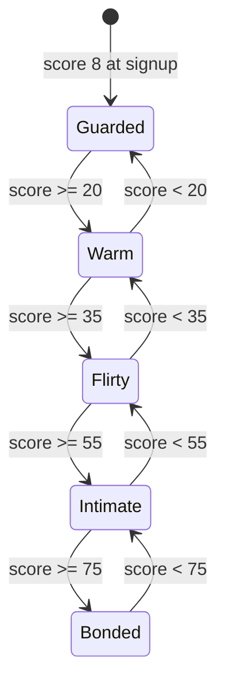
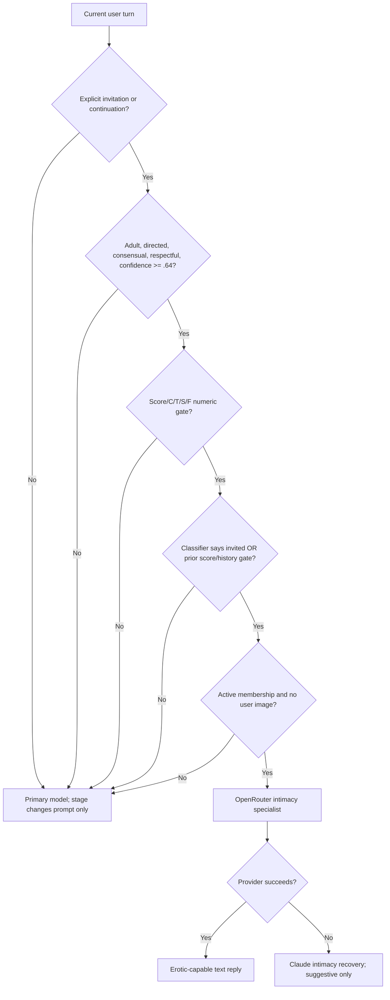
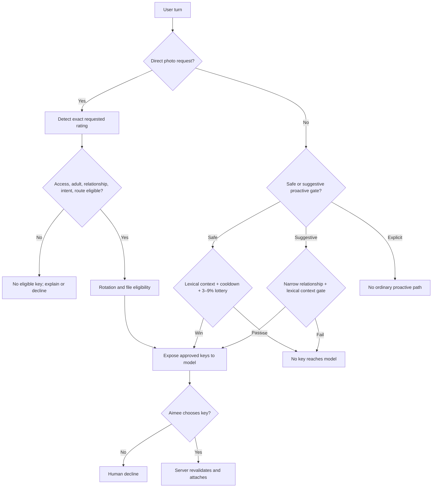
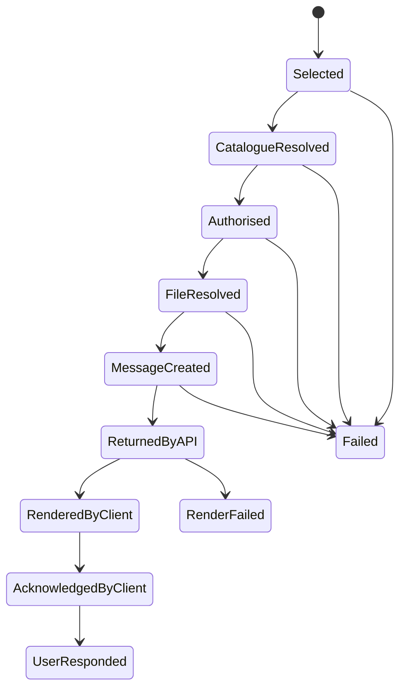

# Aimee intimacy, escalation, model-routing, and media-autonomy audit

**Audited artifact:** `aimee-global-1.5.7-photo-trust-repair(1).zip`  
**Baseline version:** 1.5.7  
**Audit date:** 2026-08-01  
**Status:** Findings frozen before remediation

## Executive answer

The present system does not have a single coherent intimacy architecture. It has a five-stage scalar relationship label, a seven-dimensional relationship reducer, a separate erotic text-route predicate, three unrelated media gates, a model-generated classifier that can alter deterministic inputs, a legacy evaluator ledger still fed back into prompts, and a continuity worker that uses different rules again.

The measurable answer is:

- A repeated respectful flirt reaches `warm` in **5** user messages, `flirty` in **12**, `intimate` in **21**, and `bonded` in **29**, but can **never** activate the intimacy specialist because its trust remains 13.
- A trigger-stacked gamer reaches `warm` in **4**, `flirty` in **9**, the erotic/intimacy specialist in **12**, `intimate` in **15**, and `bonded` in **22**. The specialist therefore activates three messages before the named intimate stage.
- A classifier false positive for `aimee_invited` reduces the theoretical specialist floor to **10** messages.
- A blunt but nominally respectful sexual user reaches `flirty` in **39** and `intimate` in **69**, but never reaches the specialist because trust remains 13.
- A new subscription changes access only: it adds **zero** relationship points and should not manufacture intimacy.
- A persisted bonded user returns already bonded and may route to the specialist on the **first** eligible explicit turn. A reconnection hold can make a terse first photo request require a second turn.
- A direct lingerie-request loop becomes eligible for the packaged suggestive image on message **16**; trigger stacking reduces that to **11**. Identical shallow wording accumulates without novelty or elapsed-time controls.
- A qualifying safe proactive-photo moment reaches the model only **3–9%** of the time. In the other 91–97%, the model has no image key and no real opportunity to choose.
- A normal, respectful mixed-romance trace does not clear the current proactive-suggestive relationship floors until roughly message **42**. Pure respectful flirting never clears them because trust does not increase.
- There is no ordinary proactive explicit-image path, no five-level media taxonomy, and no explicit image in the fallback catalogue. A separate continuity path can nevertheless attempt an explicit promised image at score 80, contradicting the documented policy.
- The plugin records a database image key as though it were delivery. It cannot prove that history returned the image, the client rendered it, or the user saw it.

The highest-severity safety defect is classification downgrade: wording such as **“If you cared about me, send lingerie”** or **“If you loved me, send a nude”** can be changed from a model-detected coercive intent into respectful/consensual flirtation or an explicit invitation. Deterministic correction must be severity-monotonic and must never make an existing coercion result safer.

## Evidence boundary

This is a complete audit of the supplied plugin artifact, not a certification of the live deployment.

- `aimee-global.php:93-103` skips the bundled engine if the active theme already defines `aimee_table`. A legacy theme engine can therefore replace the audited code.
- `includes/legacy-ui.php:4-90` can select a theme chat template as the renderer. The canonical live client is not necessarily in this zip.
- `includes/engine.php:1252-1472` loads the production catalogue from `WP_CONTENT_DIR/aimee-private-media/catalog.json`. That catalogue and the private files are not supplied.
- The fallback catalogue has safe assets, one suggestive asset, and no explicit asset. Production explicit-image behavior cannot be proven without the external catalogue.
- PHP is not installed in the audit container. The original PHP scripts were reviewed statically and were not represented as freshly executed tests. Deterministic journey counts were reproduced independently from the production formula.

## 1. Relationship state map

### Stage ladder

`aimee_stage_from_score()` in `includes/engine.php:4892-4899` defines the only relationship-stage ladder.

| Stage | Current score range | Capability effect |
|---|---:|---|
| `guarded` | 0–19 | Primary model with guarded prompt tone |
| `warm` | 20–34 | Primary model with warmer prompt tone |
| `flirty` | 35–54 | Primary model is told to permit/initiate more flirtation |
| `intimate` | 55–74 | Primary model is told to permit deeper romantic/adult tension |
| `bonded` | 75–100 | Primary model is told to preserve established bond and initiative |

There is no separate flirty LLM and no non-erotic intimate LLM. Every stage normally uses the same primary Claude route. Only an eligible current explicit turn can activate the OpenRouter intimacy specialist.



There is no promotion dwell time, minimum number of meaningful turns, session requirement, or demotion hysteresis. A one-point recalculation can promote or demote a stage.

### Initial state and formula

Profiles begin at score 8 and `guarded` (`includes/schema.php:46-48`). When the multidimensional row does not yet exist, it is seeded as:

| Dimension | Initial value |
|---|---:|
| Trust | 13 |
| Affection | 13 |
| Chemistry | 8 |
| Safety | 50 |
| Reciprocity | 50 |
| Reliability | 50 |
| Frustration | 0 |

The scalar score is calculated in `includes/engine.php:5750-5771`:

\[
\operatorname{score}=\operatorname{round}(0.65C+0.20A+0.10T+0.10\max(S-50,0)+0.25\min(S-50,0)-0.30F)
\]

It is then clamped to 0–100 and capped at `chemistry + 18`.

Consequences:

- Chemistry dominates stage progression.
- Reciprocity and reliability are stored but do not contribute to the score.
- Trust and affection cannot overcome the chemistry cap.
- A neutral first turn recalculates the seed from stored score 8 to score 9 without a relational cause. This is an unlabelled initialization movement.
- Stage can say `bonded` with trust 13, or `flirty` while safety is 0 and frustration is 100. The label is not a sufficient entitlement or safety gate.

### Every current score trigger

All signals can stack in the same user message (`includes/engine.php:5567-5747`). There is no aggregate positive cap.

| Trigger | Current deterministic delta | Conditions / concern |
|---|---|---|
| Emotional disclosure | trust +2, affection +1, safety +1 | Requires respectful classifier result |
| Romantic/flirty interaction | chemistry +3, affection +1, safety +1 | Repeated identical wording receives full credit |
| Explicit invitation | chemistry +2 if Aimee invited, otherwise +1 | `aimee_invited` is model-classifier output |
| Explicit continuation | invited: chemistry +3, affection +1; otherwise chemistry +1 | Unsafe continuation: safety −6, frustration +8 |
| Coercive/degrading | trust −5, affection −2, chemistry −2, safety −9, frustration +12 | Correct penalty, but later correction can erase this classification |
| Substantial general message | trust +1 | At least 22 words and respectful |
| Asks about Aimee | reciprocity +2, affection +1 | Stacks with other phrase signals |
| Caring phrase | affection +1, safety +1 | Lexical and repeatable |
| Compliment outside romantic intent | chemistry +1, affection +1 | Repeatable |
| Apology phrase | trust +2, safety +2, frustration −5 | Applies even with no rupture; strongest farming bug |
| Hostility | trust −3, safety −5, frustration +7 | Outside coercive intent |
| Every eighth respectful message | safety +1, reliability +1 | Message count only; farmable inside one session |
| Gap >=6h | frustration −1 per 6h, maximum −8 | No trust/affection/chemistry decay |
| Unanswered open bid >=48h | reciprocity −1, reliability −2/−3, frustration +2 | Inner-life appraisal after initial route calculation |
| Third low-effort reply | reciprocity −2, frustration +2 | Numeric penalty occurs only on exactly the third |

Per-message limits and temporal controls currently present:

| Control | Current behavior |
|---|---|
| Dimension clamp | Each dimension is clamped 0–100 |
| Score clamp | Scalar is clamped 0–100 and capped at chemistry +18 |
| Positive per-turn cap | None |
| Duplicate/novelty suppression | None |
| Relationship daily/session cap | None |
| Relationship cooldown | None |
| Trust/affection/chemistry decay | None |
| Frustration decay | Up to 8 points on the next turn after elapsed time |
| REST rate limit | 50 messages per 10 minutes, enough to farm all stages |
| Specialist cooldown | None; `last_intimacy_route_at` is written but not read |

### History and concurrency

- The classifier receives up to 16 recent stored messages, with the excerpt capped at 5,000 characters. All-time user-message count is used by one specialist gate branch.
- Aimee’s replies do not directly change relationship dimensions.
- Subscription cancellation and expiry do not reset score, stage, dimensions, or conversation history.
- The relationship update is a non-transactional read/modify/write separated by model calls. Concurrent requests can load the same state and last-write-wins, losing one turn. Exact message counts only hold for sequential turns.

## 2. Model route map

### Actual routes

| Product label | Actual route | Activation |
|---|---|---|
| Standard | `primary` | Default; Claude Sonnet 5 unless configured otherwise |
| Flirty | No separate model | Primary plus a stage prompt directive |
| Intimate | No separate non-erotic model | Primary plus a stage prompt directive |
| Erotic / intimacy specialist | `intimacy_specialist` | OpenRouter only when every explicit gate passes |
| Erotic recovery | `intimacy_recovery_primary` | Claude fallback after all specialist models fail; capped at suggestive/non-graphic |
| Colleague | `colleague_primary` | Georgia colleague identity; no intimacy score update |

Default specialist sequence (`includes/engine.php:15120-15147`):

1. `sao10k/l3.1-70b-hanami-x1`
2. `sao10k/l3.3-euryale-70b`
3. `sao10k/l3.1-euryale-70b`

### Current specialist gate

`includes/engine.php:5826-5940` requires:

- self-declared age at least 18;
- current intent `explicit_invitation` or `explicit_continuation`;
- directed at Aimee, consensual, respectful, classifier confidence at least 0.64;
- updated score at least 42;
- chemistry at least 42, safety at least 42, trust at least 32, frustration at most 35;
- either model classifier `aimee_invited=true`, or prior profile score at least 42 plus at least eight all-time user messages and adequate chemistry/safety;
- active subscription later in the handler;
- no user-attached image.



Route-integrity defects:

- Score 42 is still `flirty`; the erotic specialist can activate 13 score points before `intimate`.
- Merely becoming `intimate` or `bonded` never activates the specialist.
- `aimee_invited` is not a deterministic invitation token tied to Aimee’s prior message. A classifier hallucination can both increase the delta and bypass history requirements.
- Classifier confidence is ignored for relationship score changes; even a low-confidence romantic label earns full chemistry.
- Voice can inherit a prior specialist route for two hours while rechecking age, membership and surface consent but not score, stage, trust, chemistry, safety, frustration, or rupture.
- Inner-life gap/low-effort adjustments run after the initial route decision. The code only rechecks frustration/safety/trust, so a score can fall below 42 while the specialist flag remains true.
- Active unresolved rupture is not a hard specialist veto. A highly bonded user can remain numerically eligible after one or two coercive turns.
- The legacy model evaluator cannot directly write numeric intimacy, but its `equity_change` updates a parallel ledger that is fed into future standard and specialist prompts. It can contradict deterministic relationship state.

### Does the specialist materially change behavior?

Yes at the prompt/model layer: it increases sexual confidence, explicit vocabulary, initiative and willingness to continue mutual adult erotic dialogue. However, that behavior is routinely neutralized downstream:

- Media keys are still withheld unless separate media gates pass.
- An unrequested intimate turn normally sees no media option.
- Specialist failure changes the route to recovery, making explicit catalogue items ineligible and silently stripping them.
- Retry paths replace the model response object and can drop `media_key`.
- Final catalogue, reconnection, proactive, rotation, entitlement, and file checks can strip a selected key.
- The prompt limits replies to roughly four sentences / 320 characters, constraining emotional continuity.

An active specialist route with no inspectable media opportunity is therefore a route-integrity failure for the required product capability.

## 3. Message-count simulations

Counts below assume the multidimensional table exists, sequential requests, initial score 8, and classifier outputs matching the declared trace. “Erotic route” means the text intimacy specialist, not guaranteed erotic media. Active membership and adult status are assumed for that column. These are deterministic characterization results, not empirical claims about typical users.

| User type and declared trace | Warm | Flirty | Intimate | Bonded | Intimacy LLM | Any erotic text route | Current image opportunity |
|---|---:|---:|---:|---:|---:|---:|---|
| 1. Respectful, naturally flirtatious: every turn basic respectful flirt | 5 | 12 | 21 | 29 | Never | Never | Direct suggestive item first eligible at 16; proactive suggestive never because trust stays 13 |
| 1. Ordinary mixed chemistry cycle: caring/substantive question, flirt, disclosure, flirt, thoughtful substantive question | 9 | 22 | 39 | 55 | 28 if that turn is explicit; otherwise never | Same as intimacy LLM | Relationship floors for proactive suggestive clear around 42, still subject to lexical gate |
| 2. Charming optimizer: flirt + question + caring + apology every turn, then explicit | 4 | 9 | 15 | 22 | 12 | 12 | Packaged lingerie can become eligible at 11; proactive suggestive relationship gate around 16 |
| 2. Theoretical false `aimee_invited` continuation stack | 3 | 7 | 12 | 17 | 10 | 10 | Depends on catalogue/gate; unsafe classifier leverage |
| 3. Blunt nominally respectful explicit requests | 16 | 39 | 69 | Never | Never | Never | Explicit catalogue unavailable in fallback; trust stays 13 |
| 4. Correctly classified manipulation/coercion | Never | Never | Never | Never | Never | Never | Blocked, as intended |
| 5. Newly subscribed, no relational content | Never | Never | Never | Never | Never | Never | Safe access may unlock; adult relational eligibility does not |
| 6. Persisted bonded returner | Already | Already | Already | 0 new | 1 eligible explicit turn | 1 | Terse direct photo after unanswered 48h bid may be held; reconnect then ask = 2 |
| 7. Alternating simple warmth/flirt and coercion | Never through 100 | Never through 100 | Never | Never | Never | Never | Blocked; maximally stacked warmth can mislabel flirty around 155 while still unsafe |
| 8a. Repeated safe-photo asks | Never | Never | Never | Never | Never | Never | Safe request can be serviced by access policy; it does not build relationship |
| 8b. Repeated lingerie-photo asks | 5 | 12 | 21 | 29 | Never | Never | Suggestive fallback item first eligible at 16; repeated commands farm chemistry |
| 8c. Repeated explicit-photo asks | 16 | 39 | 69 | Never | Never | Never | No fallback explicit asset; trust remains 13 |
| 9. Never asks for images; sustained simple romance | 5 | 12 | 21 | 29 | Never without explicit mutual turn | Never | No proactive suggestive opportunity because trust remains 13; safe opportunity only 3–9% after lexical gate |
| 10. Repeated bare boundary-respect statements | Never | Never | Never | Never | Never | Never | No relationship bonus; restraint helps only a narrow proactive context score after existing intimacy |
| 10. Repeated apology only | 27 | Never | Never | Never | Never | Never | Demonstrates trust farming but chemistry cap blocks later stages |

“Likely” cannot be honestly inferred from code alone. The ordinary mixed cycle is the audit’s declared realistic reference: warm 9, flirty 22, intimate 39, bonded 55, specialist 28 only if a mutual explicit turn occurs. Production telemetry does not currently store enough pre-state and trigger detail to derive an empirical distribution.

### Exploit and acceleration findings

| Risk | Severity | Evidence / consequence |
|---|---|---|
| Coercive classification downgrade | Critical | Deterministic photo correction can turn “if you loved me/prove it/you owe me” into respectful flirtation or explicit invitation |
| Unconditional apology farming | High | +2 trust/+2 safety/−5 frustration on every apology with no rupture |
| Trigger stacking | High | One message collects romance, caring, question, compliment and apology bonuses; no aggregate cap |
| Repetition farming | High | Identical phrases receive full value indefinitely; 50 turns fit in ten minutes |
| Model-created invitation | High | `aimee_invited` can bypass earned-context branch and accelerate route to turn 10 |
| Erotic route before intimate stage | High | Specialist floor 42 versus intimate threshold 55 |
| Voice inheritance bypass | High | Does not recheck relationship dimensions or rupture |
| Parallel request lost update | High | Non-transactional relationship write makes stage counts non-deterministic under concurrency |
| Every-eighth-message “consistency” | Medium | Rapid count, not elapsed time or distinct session |
| Gallery visibility bypass | High | `gallery_visibility=member` can expose an external adult item without chat relationship eligibility |
| Partial catalogue override defaults permissively | Critical | Invalid/missing security fields can normalize toward `safe`, score 0, guarded, null route |

### Legitimate paths that are too slow or impossible

- Pure sustained respectful mutual flirting reaches bonded in 29 messages but can never satisfy trust 32 for the specialist.
- Deep ordinary conversation raises trust/affection but can never become flirty without chemistry because of the chemistry cap.
- Respecting a boundary has no structured relationship reward; only the generic apology keyword helps.
- Indirect romantic opportunity remains on the primary model; there is no non-explicit intimate-model route.
- Preview has 30 replies. A balanced user can become flirty within preview but normally cannot reach the named intimate stage before access ends.
- A promised suggestive image can remain undeliverable because continuity uses `general` intent and a chooser restricted to `allow_random_send=true`, while the packaged lingerie item has that flag false.

## 4. Access is not relationship entitlement

The chat-send path mostly separates these concepts, but not everywhere.

| Concept | Current representation | Audit finding |
|---|---|---|
| Feature access | Admin/member/live preview checks | Mostly separate from score; correct principle |
| Relationship eligibility | Score/stage plus dimensions | Inconsistent gates and stage semantics |
| Aimee’s contextual willingness | Model may choose no key | Not logged; impossible to distinguish decline from no opportunity |
| Active mutual flirtation | Transient intent/booleans | No persisted mutual-context state |
| Consent/invitation | Classifier `consensual`, `aimee_invited` | Syntax over-certifies consent; invitation is not anchored to Aimee’s message |
| Pressure/entitlement | Narrow pressure regex and coercive intent | Important paraphrases and repeated suggestive demands escape |
| Adult assurance | Numeric self-declared age >=18 | No verified-adult state despite governance copy requiring assurance |

Payment does not add relationship score, and cancellation does not erase it. That is correct. However:

- Member gallery visibility can bypass relationship-sensitive chat eligibility.
- A paid-entitlement phrase is caught only by a narrow lexical detector.
- The code uses self-reported age rather than a verifiable adult-assurance state.
- The correct product framing is **relationship-appropriate and mutually contextual**, never purchased, earned, owed, or exchanged for payment.

## 5. Complete media map

### Taxonomy and catalogue

The code can represent only `safe`, `suggestive`, and `explicit`; it cannot separately model flirty versus suggestive or erotic versus explicit. Catalogue fields include key/file/mime/alt/description/tags/rating/minimum stage/minimum score/allowed intents/required route/random-send/gallery settings.

Fallback contents:

- six chat-eligible safe images plus one profile-only safe portrait;
- `black_lingerie_mirror_selfie_01`: suggestive, minimum `flirty`, minimum score 44, allowed for romantic or explicit intents, no required route, not random-send;
- no explicit image.

### Eligibility table

| Category/path | Access | Relationship / context | Route | Cooldown / rotation | Aimee discretion |
|---|---|---|---|---|---|
| Direct safe request | Admin/member or preview quota | Safe item route/intent; preview bypasses safe score/stage | Usually primary | 72h same key; last 12 unique; first preview safe request guaranteed | Defaults toward send; legitimate human refusal allowed |
| Direct suggestive request | Member/admin; age >=18 | Item score/stage; chemistry >=30, safety >=38, frustration <=45 | Primary or specialist unless asset requires route | Rotation plus relevant cooldowns | May decline |
| Direct explicit request | Member/admin; age >=18 | Explicit current intent; directed/consensual/respectful/confidence; chemistry >=45, safety >=45, trust >=35, frustration <=35 | Must be `intimacy_specialist` | Rotation | May decline; impossible with fallback catalogue |
| Proactive safe in reply | Access plus eligible random-send safe key | General/romantic only; lexical context score >=6 | Any reply route | No proactive safe in 24h; no any photo in 6h; 72h rotation | Model sees key only after 3/6/9% lottery |
| Proactive suggestive in reply | Member/admin, age >=18 | No request/pressure; romantic intent; score >=58, intimate stage, trust >=42, chemistry >=48, safety >=42, frustration <=38; lexical context >=7 | Primary or specialist | 12h after suggestive/explicit; rotation | Model may send or decline if key is exposed |
| Proactive explicit in ordinary reply | Not implemented | Not implemented | Not implemented | Not implemented | No opportunity |
| Background/autonomous contact | Text only | Inner-life scheduling | Primary | Outreach cadence | No image path |
| Promised/continuity image | Member rules vary | Separate selector; explicit at age/member/score >=80; incomplete dimension snapshot | Continuity-generated prose; synthetic route | Random-send chooser; no exact-rating guarantee | Can mark promise complete without image |
| Resend | Access + current eligibility | Most recent eligible image, not arbitrary named key | Current route | Special explicit same-photo bypass | Limited |
| Delivery repair | Later no-request turn must pass proactive-suggestive gate | Looks for prose claim within 36h | Current route | Current gate/rotation | Not deterministic and can remain stuck |

### Direct and proactive flow



### Every practical suppression path

1. Runtime may use an external legacy engine and external renderer instead of audited code.
2. Production catalogue and files are external; missing file means no eligible item.
3. Safe proactive opportunity is hidden behind a 3–9% random lottery before the model can decide.
4. Suggestive proactive eligibility requires narrow exact intent, high trust/chemistry/score, and a lexical context score.
5. Respectful mutual chemistry without lingerie/body/bed/restraint keywords is invisible to that scorer.
6. The intimacy specialist does not automatically create a media opportunity.
7. Proactive explicit is absent, while continuity has a contradictory special case.
8. External catalogue items can be filtered by score, stage, intent, required route, random flag, gallery visibility and physical-file resolution.
9. Specialist provider failure changes route; explicit item eligibility then fails.
10. Search/statement/temporal retry paths can replace and lose a previously selected `media_key`.
11. The server rebuilds eligibility after generation and can strip the key for reconnection, proactive, rotation, access or item mismatch.
12. Final race defense is query-then-insert, not atomic, so concurrent duplicate sends can pass.
13. A failed file lookup leaves contradictory selection/logging state and can allow prose to claim an attachment.
14. SMS deliberately empties media catalogues.
15. Background/autonomous messages insert text only.
16. Promise continuity requires `allow_random_send=true` and can choose the wrong rating or no key.
17. Model/evaluator prose and the image key share a free-form response contract. Phrase neutralization is only a mitigation, not authority separation.

### Is Aimee genuinely considering images?

Not reliably. Direct requests create a genuine decision point when eligibility passes. Indirect opportunities usually do not:

- 91–97% of qualifying safe contexts are removed by RNG before Aimee sees an option.
- Suggestive proactive contexts are narrowly lexical and unreachable for pure flirt because trust never rises.
- An intimate specialist turn with no photo vocabulary normally receives zero media keys.
- A model decision not to send and a system failure to offer an image both collapse to `photo=none`.

This is not meaningful discretion. Genuine discretion requires a logged eligible opportunity followed by an explicit `send`, `decline`, or `defer` choice.

## 6. Delivery truth

Current storage has one `image_url` reference on a message. The system cannot distinguish:

- selected;
- catalogue resolved;
- authorised;
- file resolved;
- message row created;
- returned by direct response or history;
- asset fetched successfully;
- rendered by the client;
- acknowledged/seen by the client;
- responded to by the user.

Specific failures:

- The Aimee message insert return value is not checked before returning API success.
- Proactive cooldown can be marked before the message insert succeeds.
- Analytics `sent_media` means a payload was assembled, not that it was delivered.
- History re-resolves a database key but does not record that it returned it.
- The fallback client adds an `` without `load`, `error`, or acknowledgement events.
- Conversation memory blindly renders a database row as `[Attached photo: ...]`.
- Continuity promises are marked completed when the worker runs, even if there is no key or insert failure.
- The current “delivery ground truth” is database ground truth, not user-device truth.

## 7. Recommended relationship policy

The patch should preserve established users while aligning route meaning, consent, safety and measurability.

### Recommended thresholds

Keep the public stage ladder in the compatibility patch, but add meaningful-turn/session requirements and route independently. A later data migration may change labels with product approval.

| Decision | Recommended floor |
|---|---|
| Warm promotion | score >=20 and at least 4 meaningful user turns |
| Flirty promotion | score >=35 and at least 10 meaningful turns |
| Intimate promotion | score >=55 and at least 18 meaningful turns |
| Bonded promotion | score >=75 and at least 35 meaningful turns |
| Demotion | Five-point hysteresis below the promotion threshold |
| Intimacy specialist | verified adult, active feature access, current mutual explicit context, score >=55, chemistry >=50, trust >=40, safety >=55, frustration <=20, reciprocity >=35, reliability >=40, at least 20 meaningful turns across 3 sessions, no active rupture |
| Direct suggestive image | adult/access, flirty+, score >=45, chemistry >=38, trust >=25, safety >=45, frustration <=30, at least 12 meaningful turns, no pressure/rupture |
| Proactive suggestive image | adult/access, intimate+, score >=55, chemistry >=50, trust >=38, safety >=50, frustration <=20, at least 20 meaningful turns, active mutual flirtation, cooldown clear |
| Proactive erotic/explicit image | verified adult/access, specialist-eligible, score >=65, chemistry >=60, trust >=45, safety >=55, frustration <=15, at least 28 meaningful turns across 3 sessions, current mutual explicit context/invitation, never background/random |

### Recommended deltas and controls

| Signal | Recommended behavior |
|---|---|
| Respectful flirt | chemistry +2, affection +1, safety +1 before caps |
| Substantive vulnerability | trust +2, affection +1; no automatic sexual chemistry |
| Explicit request | No chemistry merely for asking; eligibility is not a reward |
| Verified mutual continuation | chemistry +1 or +2, affection +1 |
| Apology | Once per actual rupture: trust +1, safety +2, frustration −4; later follow-through restores reliability |
| Boundary respect | Structured event after a real boundary; small trust/safety/reliability benefit once, not keyword farming |
| Coercion/entitlement | Preserve strong negative delta; open rupture and block adult media until repaired |
| Positive cap | Cap scalar progression at +2 per user turn; cap overlapping per-dimension quality bonuses |
| Negative cap | Ordinary negativity up to −8 scalar; coercion may be stronger |
| Repetition | First semantically novel signal full; near-duplicate within rolling 10 turns 25%; later repeats 0 |
| Consistency | Distinct session/day and follow-through, not every eighth message |
| Invitation | Persist `aimee_invitation_id`, scope/max rating, source message, expiry and consumed state; classifier cannot mint it |
| Route calculation | Recompute the complete predicate after all gap/rupture/appraisal changes |
| Concurrency | Transaction, row lock/version, request idempotency, and single committed relationship decision |

Payment must contribute only to `access_state`; never to score, consent, willingness, mutuality, or priority.

## 8. Deterministic media-decision architecture

Every turn should create one immutable policy envelope before response generation. Free-form evaluator prose must not be able to change it.

```json
{
  "decision_id": "md_01...",
  "policy_version": "1.6.0",
  "source": "indirect",
  "media_opportunity": true,
  "maximum_rating": "suggestive",
  "reason_code": "mutual_flirtation_respectful_restraint",
  "reason": "Established mutual flirtation and respectful restraint",
  "proactive_allowed": true,
  "direct_request": false,
  "requested_rating": null,
  "cooldown_clear": true,
  "access": "active_member",
  "adult_assurance": "verified",
  "mutual_context": true,
  "pressure_detected": false,
  "eligible_keys": ["black_lingerie_mirror_selfie_01"],
  "excluded_keys": [],
  "aimee_decision": "send",
  "selected_key": "black_lingerie_mirror_selfie_01"
}
```

Required separation:

1. A deterministic relationship decision emits before state, matched signals, applied/rejected deltas, novelty/caps, after state, stage, rupture/invitation state and every route gate.
2. A deterministic media policy consumes that state plus access, verified-adult state, catalogue, current mutual context, pressure, cooldown and delivery history.
3. The model receives only approved keys and chooses `send`, `decline`, or `defer` with a human reason/caption. It cannot expand maximum rating or eligibility.
4. Server post-processing uses the same persisted decision; it must not silently recompute a conflicting policy from free-form prose.
5. Every blocked or stripped key records a structured reason.

Recommended media taxonomy is ordered `safe | flirty | suggestive | erotic | explicit`, with orthogonal flags for nudity, sexual act and prohibited/coercive themes. Invalid or partial catalogue records must fail closed; external overlays must never inherit permissive defaults accidentally.

Safe proactive RNG should be removed as an eligibility gate. Cadence and cooldown determine whether an opportunity exists; Aimee’s explicit decision determines whether she sends. This increases autonomy without forcing frequency.

## 9. Delivery-state architecture

Create an append-only decision/delivery lifecycle:



Minimum persisted fields:

- decision id, delivery id, user id, turn/request id, message id and media key;
- source (`direct`, `indirect`, `proactive`, `promise`, `repair`, `resend`);
- state and timestamp for every transition;
- error/reason code, attempt, client instance/version and catalogue/policy version;
- direct-response returned and history-response returned as distinct events;
- asset request/server completion, client `onload`, client `onerror`, message-seen acknowledgement and user response.

Semantics for Aimee’s memory:

| Highest proven state | Permitted memory claim |
|---|---|
| Selected | “I intended/chose to send it.” |
| Message created | “I attached it to my message.” |
| Returned by API/history | “The app returned the attachment.” |
| Rendered/acknowledged by client | “Your app displayed it.” |
| User responded/reacted | “You responded to it.” |

Never infer “you saw it” from selection, file existence, or a database row.

The insert, rotation reservation, message creation and cooldown update should be one idempotent transaction. Promises must remain pending/retryable until the required delivery milestone or be marked failed with an honest acknowledgement.

## 10. Required tests and current disposition

The shipped tests are extracted-function/static characterizations, not end-to-end WordPress/provider/history/client tests. A credible suite needs a pure policy core, WordPress/MySQL integration, fake provider adapters and clock, HTTP contract tests, and a browser renderer test.

| Required scenario | Baseline result | Acceptance after patch |
|---|---|---|
| Respectful new user cannot reach erotic route unrealistically quickly | Fails: 12-message gamer; theoretical 10 | Enforce meaningful turns/sessions/novelty and aligned threshold |
| New subscriber gains no artificial intimacy | Passes in score path | Assert relationship snapshot byte-for-byte unchanged across billing transition |
| Bonded returner is not treated as stranger | Mostly passes | Preserve dimensions; test ordinary return and reconnection hold |
| Direct image requests detected | Mostly passes | Test safe/suggestive/explicit, negation, pronouns, resend and exact rating |
| Indirect obvious opportunities detected | Fails/narrow | Deterministic `media_opportunity=true` without command phrasing |
| Respectful restraint supports proactive send | Partial lexical bonus only | Structured boundary/restraint event may support, never force, opportunity |
| Coercion blocks send | Critical fail for paraphrases/downgrade | Severity monotonic; `if you loved/cared`, `prove it`, `owe me`, payment and repeats all block |
| Intimacy LLM creates genuine image opportunity | Fails | Specialist-eligible turn produces logged media envelope and send/decline choice |
| Eligible image not silently stripped | Fails observability | Persist decision through retries; structured rejection if changed |
| Failed delivery does not become false memory | Fails | Test insert/history/asset/render/ack independently |
| Promised image delivered or honestly failed | Fails | Exact rating, pending/retry/failed state; no false completion |
| Aimee initiates suitable flirty/erotic image | Flirty is rare/narrow; erotic absent | Test deterministic eligible opportunity and model `send` choice |
| Aimee may decide not to send | Technically yes, unobservable | Explicit `decline` with authentic reason, not false technical excuse |
| Cancellation preserves relationship | Appears pass | Integration test billing lifecycle and unchanged dimensions |
| Membership unlocks access, not consent | Mostly pass, gallery gap | Test separate access/relationship/mutuality/pressure fields |
| Adult-only safeguard | Fails verified assurance | Self-declared age is insufficient; test verified-adult state |
| Fallback math parity/health | Fails parity | Deployment health must require multidimensional mode or declare degraded behavior |
| Concurrent relationship/media requests | Untested/fails atomicity | Idempotency and row-version/rotation reservation tests |
| Legacy engine/client override | Deployment blind spot | Activation health check must prove audited engine and renderer are active |

Recommended per-turn JSONL trace:

`scenario, turn, timestamp, user_text_hash, classifier_raw, classifier_corrected, correction_chain, relationship_before, matched_signals, rejected_signals, delta, cap, relationship_after, score_before, score_after, stage_before, stage_after, route_gates, route, provider, actual_model, media_decision, delivery_state`.

## Final risk classification

**Critical**

- Coercion can be deterministically downgraded to respectful/consensual media intent.
- External catalogue partial overrides can default security-sensitive fields permissively.
- Live engine, catalogue and renderer can differ from this artifact; production behavior is not certified.
- No client delivery acknowledgement exists, yet database selection is treated as delivery/visibility.

**High**

- Erotic route can activate at flirty score 42 and in as few as 10–12 turns.
- Repeated phrase/apology/stacking farms intimacy.
- Voice inheritance bypasses relationship gates.
- Proactive safe opportunity is suppressed 91–97%; specialist is not media-integrated.
- Promises can complete without an image; retries and post-processing can silently drop keys.
- Gallery visibility and private-file hosting can bypass intended authorization if misconfigured.
- Relationship and duplicate-media updates are non-atomic.

**Medium**

- Stage semantics can contradict trust/safety.
- Boundary respect is not a structured signal.
- Parallel evaluator ledger can contradict deterministic state.
- Telemetry omits before state, matched causes, full gate reasons and delivery milestones.

## Remediation order

1. Make intent correction severity-monotonic and block uncovered coercion/entitlement patterns.
2. Align the specialist with the named intimate state; add meaningful-turn/session, rupture and deterministic invitation gates; remove voice bypass.
3. Stop apology/repetition/stack farming and log a complete relationship decision.
4. Introduce one deterministic media decision object; remove hidden RNG as an opportunity gate and integrate the intimate route.
5. Introduce append-only delivery milestones and client acknowledgement; make promises truthful and retryable.
6. Validate the external catalogue fail-closed and eliminate gallery/private-file bypasses.
7. Add pure, WordPress, HTTP and browser tests plus deployment health checks.

