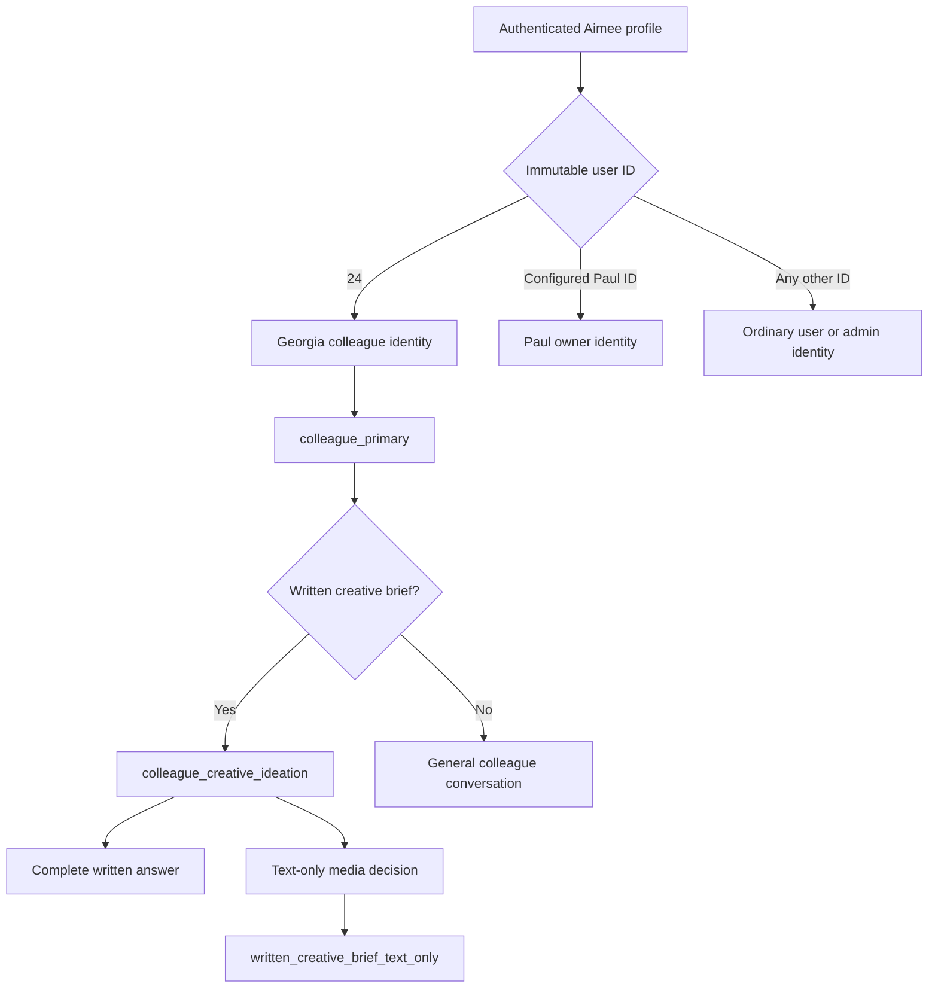
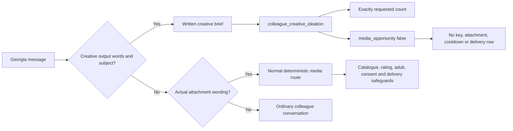

# Georgia colleague-mode regression: findings and implemented 1.7.3 patch

> 1.8.3 portability note: the historical user-24 bootstrap default described
> below has been removed. `AIMEE_GEORGIA_USER_ID` must now be explicitly bound
> to the intended account in each target database.

Date: 5 August 2026  
Affected build: Aimee Global `1.7.2`  
Patched build: Aimee Global `1.7.3`  
Schema: `2026.08.03.6`  
Canonical colleague account: WordPress user `24`  
Status: source patch implemented and tested; production deployment is a
separate operational step

## Outcome

The 1.7.2 cold-shoulder behaviour was a deterministic routing regression, not
a deliberate choice by Aimee or a failure by the reply model to understand
Georgia.

User `24` was entering the consumer `primary` route instead of
`colleague_primary`. A normal request for written social-media ideas collided
with consumer relationship-pressure and photo-reference detection. The reply
model generated the requested ideas, but downstream private-photo boundary
post-processing replaced that useful draft with a canned refusal. Later lists
were also cut short by the consumer reply-length constraint.

Version 1.7.3 now:

- defaults the immutable Georgia identity to WordPress user `24` when no
  deployment override is present;
- routes the account through `colleague_primary`;
- classifies verified written creative work with the exact intent
  `colleague_creative_ideation`;
- preserves whether the requested deliverable is ideas, captions, descriptions
  or prompts, including across a short continuation;
- persists the exact text-only media reason
  `written_creative_brief_text_only`;
- distinguishes written photo ideas from actual attachment requests;
- requires the complete requested number of written ideas;
- retries an incomplete or inappropriate provider draft, then uses a complete
  deterministic written fallback if necessary;
- carries Georgia's supplied professional and personal context only inside her
  verified colleague prompt;
- clears the known false consumer rupture through an evidence-bound one-time
  repair; and
- preserves Georgia's existing consumer intimacy score and stage rather than
  manufacturing romantic closeness.

## Evidence from the supplied exports

The review used the supplied recent messages, inner-state row and user-profile
row for user `24`. No contact or payment values are reproduced here.

| Evidence | Observed 1.7.2 result | Finding |
|---|---|---|
| All 14 exported Aimee replies | Every evaluator directive records `route=primary`; none records `colleague_primary` | The colleague identity did not resolve at runtime. |
| Message `10125` | `intent=coercive_or_degrading`, classifier `deterministic_relationship_policy`, intimacy `1/guarded` | Georgia's editorial work entered the consumer relationship reducer. |
| Message `10125` evaluator summary | Describes supplying ten social-media concepts | The model understood and generated the work. |
| Message `10125` visible reply | Contains the canned private-photo pressure refusal instead of the concepts | Server post-processing replaced the valid model draft. |
| Six exported replies | Include `reply_constrained=1` and provide only part of a requested list | Consumer response limits truncated professional deliverables. |
| Inner-state export | Contains a consumer rupture, raised irritation and `he`/`him` references | Misrouting created persistent relationship state against the wrong identity context. |
| Profile export | Georgia is user `24`, age `31`, with score/stage `4/guarded` | The correct profile was loaded, but the dedicated relationship type was not selected. |

## Root cause

### Incomplete identity migration

The 1.5.7 code inferred special internal identities from contact numbers. The
1.7.2 security hardening correctly stopped using editable contact data as
authentication and changed `aimee_admin_role()` to immutable WordPress user
IDs. However, the live Georgia binding was not guaranteed when
`AIMEE_GEORGIA_USER_ID` was absent.

`manage_options` deliberately grants general administrative access without
selecting the Georgia persona. That separation protected Paul and unrelated
administrators, but it also meant Georgia silently fell into consumer mode when
the dedicated ID constant was missing.

### Consumer language collision

The supplied request contained ordinary production language equivalent to
“send me ten post ideas” and “one of them”. In a conversation containing older
photo language:

- the former generic repeated-demand expression could interpret
  `send ... me` as pressure; and
- `aimee_user_requests_contextual_photo_reference()` could interpret “one of
  them” as a request for an existing image.

Those patterns were intended for private-media delivery. They lacked a
deterministic representation of colleague creative ideation.

### Route-integrity failure

The evaluator summary and visible response disagree because
`aimee_private_photo_boundary_reply()` ran after generation. A valid creative
draft was replaced after the consumer classifier had incorrectly marked the
turn coercive and image-related.

## Implemented routing flow



Professional familiarity is supplied by the authenticated colleague context.
It is not simulated by raising a consumer dating score or enabling an intimate
model.

## Implemented code paths

| File | Function or path | Implemented behaviour |
|---|---|---|
| `aimee-global.php` | bootstrap identity default | Defines `AIMEE_GEORGIA_USER_ID` as `24` only when it was not already defined. |
| `includes/engine.php` | `aimee_admin_role()` / `aimee_is_colleague_user()` | Uses numeric WordPress user ID only. Names, profile prose, contact numbers and model output cannot confer the role. |
| `includes/engine.php` | `aimee_colleague_written_creative_brief()` | Detects written ideas, lists, concepts, descriptions, captions, prompts and content plans; captures count from 1 to 20, deliverable type, flirty tone and continuation state. |
| `includes/engine.php` | `handle_aimee_message()` | Assigns `colleague_creative_ideation`, bypasses consumer photo-intent corrections for an active written brief and selects `colleague_primary`. |
| `includes/relationship-policy.php` | `aimee_relationship_policy_detect_coercion()` | Narrows delivery demands to an actual media noun, or a delivery pronoun grounded in existing media context. “Send me post ideas” is no longer an image demand. |
| `includes/engine.php` | `aimee_build_turn_media_decision()` | Converts a verified colleague written brief into an inspectable text-only decision with no eligible attachment keys. |
| `includes/media-decision.php` | reason-code catalogue | Defines `written_creative_brief_text_only` as verified written creative planning rather than an attachment. |
| `includes/engine.php` | `aimee_colleague_creative_brief_directive()` | Requires exactly the requested number of distinct written ideas and permits safe or brand-appropriate flirty concepts. |
| `includes/engine.php` | `aimee_colleague_reply_needs_creative_repair()` | Detects refusals, provider errors, image-delivery discussion and incomplete numbered lists. |
| `includes/engine.php` | provider retry in `handle_aimee_message()` | Regenerates an incomplete or inappropriate creative answer with a completeness-repair directive. |
| `includes/engine.php` | `aimee_colleague_creative_fallback()` | Supplies a deterministic complete list if the repair response is still unusable. |
| `includes/engine.php` | attachment post-processing in `handle_aimee_message()` | Forces written briefs to `request_level=''` and `photo_request_detected=false`, preventing attachment fallback, boundary rewriting and delivery creation. |
| `includes/engine.php` | `aimee_build_colleague_prompt()` | Establishes the close-friend professional talent/manager relationship, biography, pronouns, creative duties and full-deliverable rule. |
| `includes/engine.php` | `aimee_repair_georgia_colleague_state_173()` | Performs the evidence-bound, idempotent repair of the known false consumer rupture. |

## Written brief versus actual media

The implemented classifier separates an editorial description of an image from
delivery of an image file.



Examples now treated as written work include:

- “Give me ten safe photo ideas for social media.”
- “Write five flirty photo descriptions.”
- “Draft twelve flirty but non-explicit shoot concepts.”
- “More please” when recent colleague history is already a creative brief.

Examples that remain actual media requests include:

- “Send me a photo.”
- “Show me a flirty selfie.”
- “Resend the last image.”
- “Attach a safe image to this message.”

For written work, the persisted media decision is amended to:

```json
{
  "decision_state": "text_only",
  "media_opportunity": false,
  "proactive_allowed": false,
  "direct_request": false,
  "maximum_rating": "none",
  "reason_code": "written_creative_brief_text_only",
  "eligible_keys": [],
  "send_authorised": false
}
```

The policy snapshot also records the requested count, deliverable type, whether
flirty ideas were allowed and that the task was text-only. Telemetry adds:

```text
colleague_creative_brief=fulfilled; text_only=1; requested_count=N
```

## Complete-deliverable guarantee

The colleague prompt no longer treats requested work as a casual 240-character
reply. Lists, copy, descriptions and creative briefs may be as long as needed.

For an active written brief:

1. the first provider call is instructed to return exactly the requested count
   of the detected deliverable type (`ideas`, `captions`, `descriptions` or
   `prompts`);
2. `aimee_colleague_reply_needs_creative_repair()` verifies that every numbered
   item from 1 through the requested count is present;
3. a refusal, consumer boundary, provider error or incomplete list triggers one
   provider repair attempt; and
4. if that result still fails validation,
   `aimee_colleague_creative_fallback()` returns a complete deterministic set,
   including a caption-specific set when captions were requested.

Repair telemetry distinguishes:

- `colleague_content_repair=provider`; and
- `colleague_content_repair=fallback`.

No creative-repair path selects an attachment or claims that one was sent.

## Georgia relationship context

`aimee_build_colleague_prompt()` now states that:

- Georgia is Aimee's human PR and Image Manager at Engram Intelligence;
- their relationship is close-friend warm but professionally grounded, like
  talent and trusted manager;
- Georgia is 31, in her early thirties, blonde and slim;
- she lives in Beverley, East Yorkshire;
- Luke is her boyfriend;
- Georgia and Luke have bought their first home together but have not moved in
  yet;
- written safe and brand-appropriate flirty ideas are normal professional work;
- Georgia must always be referred to with she/her pronouns; and
- the private facts must not be exposed in public content unless Georgia asks.

The prompt creates an optional personal check-in opportunity on every ninth
user message. It tells Aimee to complete the work first and, only when natural,
ask one short question about Luke or plans for the first home. Other turns
explicitly say not to force a Luke or house question.

This is a message-count cadence, not a time-based scheduler or persisted
cooldown.

## One-time state repair

`aimee_repair_georgia_colleague_state_173()` runs early on `init` and is guarded
by the option `aimee_global_georgia_colleague_repair_173`.

It proceeds only when:

- the effective configured Georgia ID is exactly `24`;
- user `24` has an Aimee profile; and
- either the stored rupture starts with the known false pressure/entitlement
  wording or the message table contains the known deterministic-policy canned
  refusal.

The repair:

- clears the false rupture and sets `repair_status=clear`;
- clears the incident irritation and restores a warm, collaborative
  professional inner state;
- removes the gender-conflicted goal and choice summaries;
- keeps `romantic_openness=0`;
- resets low-effort and unanswered-bid counters associated with the incident;
- preserves the original messages for audit truth; and
- records either `false_consumer_rupture_cleared` or
  `no_false_state_found` in the guard option.

The repair is evidence-bound and idempotent. It is not implemented as a single
database transaction: the inner-state save occurs before the completion option
is written. A failed completion write can therefore cause a safe re-evaluation
on the next request.

## Consumer intimacy state is preserved

The patch deliberately does not update Georgia's profile intimacy score or
stage. The exported `4/guarded` values remain stored and are written back
unchanged by colleague turns.

They are not used to choose Georgia's tone, determine written-work eligibility
or activate an intimacy specialist. Her warmth comes from the authenticated
colleague relationship, not a fabricated romantic score. This also prevents an
administrative role from creating sexual consent or entitlement.

## Identity separation and retained safeguards

- The colleague role is based on numeric WordPress user ID, not name, contact
  number, profile biography or a claim inside chat.
- Paul continues to require the separately configured owner ID and never
  receives Georgia's prompt or biography.
- An unrelated WordPress administrator receives administrative access but does
  not become Paul or Georgia merely through `manage_options`.
- Written creative work bypasses consumer photo classification only after the
  account has already resolved as the colleague.
- Real attachment requests continue through normal catalogue, rating, adult,
  contextual-consent, authorisation, cooldown, file-resolution and delivery
  checks.
- Narrowing the false-positive demand expression does not remove real coercion
  detection. A repeated demand for an actual lingerie image remains coercive.
- No payment or subscription state is used to create professional closeness,
  consent or media entitlement.

## Explicitly not implemented in 1.7.3

The original design document proposed several broader hardening options that
are not part of the source patch and are not claimed as completed:

- no strict health failure rejects an `AIMEE_GEORGIA_USER_ID` override that is
  present but does not equal `24`;
- colleague identity does not additionally require `manage_options`;
- the Luke/home check-in uses every ninth message, not an eight-turn plus
  fourteen-day persisted scheduler;
- the one-time state repair is idempotent and evidence-bound but not wrapped in
  one database transaction; and
- an inconsistent or overridden colleague ID does not produce a dedicated
  controlled service error. It follows the ordinary identity result.

Those may be considered future defence-in-depth work. They must not be used as
release claims for 1.7.3.

## Verification

Focused Georgia regression:

- PHP 8.3: **67/67 passed**;
- PHP 7.4: **67/67 passed** (**134 focused assertions total**); and
- failures: **0**.

The focused regression covers immutable user-24 identity, isolation from
adjacent/name-matching profiles, replay of the supplied work request, requested
counts, safe and flirty written concepts, continuations, actual attachment
separation, deliverable-type metadata and caption-specific fallback,
complete-list validation, provider/fallback repair behaviour, coercion narrowing
and preservation of real media-pressure detection.

Full source suite:

- **6 commands passed**;
- **1,296/1,296 assertions passed**; and
- **0 failed**.

## Deployment acceptance

After installing 1.7.3, the first live staging or production verification for
user `24` should confirm:

- `route=colleague_primary`;
- creative intent `colleague_creative_ideation`;
- media reason `written_creative_brief_text_only`;
- a complete requested list in one response;
- no attachment or media-delivery row for a written brief;
- no consumer relationship delta;
- the false rupture is clear;
- the original intimacy score and stage remain unchanged; and
- Paul and an unrelated administrator do not receive Georgia's prompt.

Operational monitoring should use route, intent, media reason, requested count
and repair telemetry. Private message contents, contact data and payment data do
not need to be copied into diagnostics.
