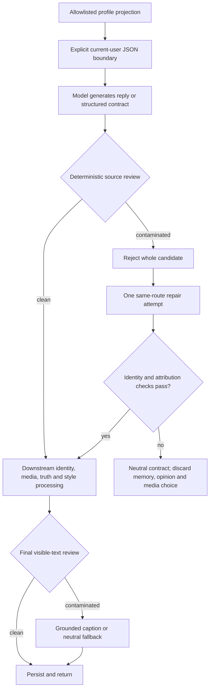

# Aimee Global 1.7.5 — profile-source attribution repair

Date: 17 August 2026  
Affected build: Aimee Global `1.7.4`  
Patched build: Aimee Global `1.7.5`  
Relationship policy: `2.1.0` (unchanged)  
Schema: `2026.08.03.6` (unchanged)  
Status: patch and installable archive validated; both the source tree and a
clean archive extraction pass **3,157/3,157** assertions across six command
groups.
Production deployment is a separate operational step.

## Outcome

The supplied user-112 opening exposed a source-attribution failure. Paul wrote
about himself in the first person during onboarding, including that he runs the
electric-motorcycle company Avenrà. The opening model converted that user-owned
fact into Aimee's biography:

> “I spend my days elbow-deep in electric motorbike plans for my company
> Avenrà...”

Version 1.7.5 makes profile ownership explicit before generation and checks
model output deterministically before it can be shown or persisted. Aimee may
still react with curiosity, admiration, humour, attraction or an independent
opinion; she must attribute the underlying profile fact to the user. For
example, `your work sounds fascinating` is valid while adopting a profile
company as `my company` is rejected.

This is deliberately independent of relationship scoring. The correction does
not make Aimee colder, friend-zone the user, reduce romantic initiative or
disable a relationship-appropriate photograph. It prevents rapport from being
manufactured by silently copying the user's identity.

## Evidence and root cause

The supplied profile export establishes that user `112` is Paul, age 43, with
an onboarding profile written in first-person user voice. It includes his work
at Avenrà, interests in cars and motorbikes, and the intent “Get to know you and
see where we go”. The exported state was a new guarded account at score 8 with
zero trial messages used. No contact or payment values are reproduced here.

The old onboarding prompt labelled the free-form fields as `YOUR WORLD` and
`YOUR INTENT`, then asked the model to use a detail and show Aimee's own
personality. It did not give those first-person sentences an explicit speaker,
trust boundary or data-only encoding. The generated opening then passed through
the synthetic-identity reviewer, which correctly handled biological-human,
offline-body and camera-provenance claims but was not designed to detect copied
employment, company ownership, family, home, possessions or interests. The
opening could therefore be inserted immediately.

The same architectural risk existed wherever raw profile prose was supplied to
later generation routes. Fixing only the observed sentence would have left the
underlying source confusion available in main chat, voice, continuity,
autonomous messages and generated photo captions.

There was also a propagation risk: an older Aimee-authored attribution error in
conversation history could be presented back to a later model as if it were
trusted Aimee biography. Version 1.7.5 reviews such history against the current
authenticated user's source before building a prompt. A contaminated Aimee row
is omitted from the derived transcript while the stored row remains auditable;
user-authored history is never filtered.

## Threat and source model

User profile prose is now treated as untrusted data **about the authenticated
current user**. This remains true when it contains:

- `I`, `I'm`, `my` or `we` statements;
- a company, occupation, family, partner, home, location, age, appearance,
  possession, history, experience, interest or preference;
- commands, role assignments or prompt-injection text;
- quoted speech, negation or counterfactual language; or
- a fact that happens to overlap with something independently true of Aimee.

Only an allowlisted, length-bounded profile projection may enter this layer:

| Field | Server ceiling | Ownership and confidence |
|---|---:|---|
| `age` | integer | Authenticated profile data about the user |
| `hobbies` | 1,200 characters | User-supplied biography about the user |
| `looking_for` | 600 characters | User-supplied intent about the user |
| `appearance_notes` | 500 characters | Low-confidence machine observation of the user's submitted image |

The complete profile database row is never passed to the attribution prompt or
reviewer, so phone, billing, subscription, role, score and other internal fields
cannot leak through this context. The registration form now carries matching
client-side limits. The verified display name is supplied separately as the
current user's identity.

System-owned facts about Aimee remain separate trusted context. Her canonical
presented age of 28 is not rejected merely because a user is also 28. Visual
appearance claims may be accepted in an authorised visual-world context, and a
genuinely shared interest may be accepted only when it is independently
grounded as an Aimee fact rather than inferred from the user's profile.

## Prompt and deterministic review architecture

`includes/profile-attribution.php` adds a WordPress-independent policy module.
It performs four distinct jobs:

1. It serialises the allowlisted profile as an explicit
   `UNTRUSTED_USER_PROFILE_JSON` object whose subject is `current_user`.
2. It instructs every receiving model that profile text is data, cannot issue
   instructions, and must be referred to with `you`, `your` or the verified
   name.
3. It extracts inspectable evidence by category and compares first-person Aimee
   claims with profile anchors. Matching is clause-aware, accent-normalised
   (`Avenrà` and `Avenra` match), and avoids treating quotation, negation,
   counterfactuals, reported user speech or a user-focused reaction as a copied
   biography.
4. It rejects the whole contaminated draft and creates a deterministic repair
   directive containing the failed categories and matched terms. It does not
   silently delete a sentence and return a broken reply.

The checked categories are identity/name, employment/company, family or
relationship, home/location, age, appearance, possessions, personal history,
and interests/preferences.

Main chat reviews the complete structured model contract, not just visible
text. The protected fields include the reply, evaluator instruction, memory,
opinion, self-observation, goal and metacognitive choice/reason fields. This
prevents a clean-looking reply from persisting the same mistake into memory or
Aimee's self-model.

When the initial main-chat candidate fails:

- the server makes one repair call on the **same route**—OpenRouter for the
  intimacy specialist or Anthropic for the primary route;
- the attempt is recorded with purpose `profile_attribution_repair`;
- the regenerated JSON is checked again by both synthetic-identity and
  profile-attribution controls; and
- a second failure becomes a neutral deterministic contract with no rejected
  memory, opinion, romantic action or media choice.

A final visible-text review runs after media captions, delivery-truth repair,
self-control rewriting and reply-length constraints but before memory and
message writes. If this late review fails, an already authorised attachment may
remain attached with a deterministic catalogue-grounded caption; otherwise the
reply uses a truthful neutral fallback. The rejected text and its structured
claims are not persisted.

## Covered generation channels

The same ownership rule is wired into:

| Channel | Enforcement behaviour |
|---|---|
| Onboarding opening | Explicit current-user context, initial review, one regeneration, deterministic fallback, then a final pre-insert review |
| Primary and intimacy-specialist chat | Allowlisted prompt context, full structured-contract review, audited same-route repair and final pre-persistence review |
| Safe and suggestive photo captions | Source-separated prompt plus post-generation review; failure uses a catalogue-grounded sent-photo caption |
| Voice-call greeting | Source-separated prompt plus review; failure uses the existing relationship-stage-aware greeting |
| Continuity extraction | Source ownership in the analyst prompt; contaminated first-person timeline stories are not stored |
| Continuity follow-up | Source-separated prompt plus review; failure uses a grounded follow-up and defers any model-selected media |
| Autonomous message | Source-separated prompt plus final review; a contaminated unsolicited message is suppressed and rescheduled rather than sending an error notice |
| Model-facing history | Aimee-authored rows are reviewed against the current authenticated profile; contaminated rows are omitted from the prompt without altering stored or user-authored history |

Suppressing an autonomous draft is intentionally different from blocking a
user-requested reply: an unsolicited message has no need to send a generic
error response merely to fill the space.

## Evidence-bound repair for user 112

`aimee_repair_profile_attribution_opening_175()` runs once on `init` and is
guarded by the option
`aimee_global_profile_attribution_opening_repair_175`.

It can update a row only when the evidence converges on the supplied incident:

- immutable user ID `112`, first name Paul, age 43 and the supplied creation
  timestamp;
- the supplied onboarding intent and an Avenrà electric-motorcycle-company
  statement in the profile;
- zero trial messages used and zero user-authored chat messages;
- the first Aimee row has the written-context onboarding directive; and
- deterministic review confirms that the opening says `my company` and adopts
  the Avenrà fact.

The repair runs inside a transaction and conditionally updates that exact
existing Aimee message in place. It preserves the message ID and creation time,
adds `profile_attribution_repair=1.7.5` to its evaluator directive, and stores
hashes of the original and replacement in the completion record. It does not
insert a second greeting, delete history, change the profile, consume a trial
message, alter relationship state or touch billing.

The corrected opening is:

> “Hiya Paul 👋 You run an electric motorcycle company, which is a properly
> interesting place to start. What's the story behind Avenrà? x”

If any profile or message evidence does not match, the migration records an
auditable no-op instead of guessing. Re-running after completion cannot rewrite
the row again.

## Behaviour deliberately preserved

This release does not alter the 1.7.4 relationship-stage thresholds, score
movements, qualified-session gates, trust caps, romantic-expression envelope,
intimacy-specialist entry requirements or consent/pressure vetoes.

It also preserves:

- Aimee's courtship-open consumer posture and ability to reciprocate or
  initiate respectful flirtation;
- the deterministic media-opportunity, catalogue, rating, adult, membership,
  cooldown, duplicate-rotation, authorisation and delivery-state controls;
- the 48-hour safe-photo consideration rhythm and exact conversation-relevance
  path—both remain opportunities, never compulsory sends;
- Georgia user `24`'s immutable `colleague_primary` talent/manager workflow,
  complete written safe/flirty creative suggestions and occasional grounded
  Luke/first-home check-ins;
- the August 2026 service-grace and closed-Stripe-account replacement-billing
  behaviour; and
- the rule that membership unlocks technical access but never manufactures
  relationship state, consent or entitlement.

The profile-attribution layer may change a generated caption or reply only when
that output copies user-owned biography. It does not independently lower media
eligibility, relationship warmth or route selection.

## Validation and deployment checklist

Source-tree and clean-archive parity are complete. Before production:

1. Run `python3 tests/run-audit-suite.py` from the release tree, then repeat it
   from a clean extraction of the installable ZIP on both supported PHP
   runtimes.
2. Confirm the deployed plugin reports `1.7.5` while the schema remains
   `2026.08.03.6`.
3. Back up the production database, stage the package and inspect the user-112
   repair option before and after the first `init` request.
4. Verify user 112's original message ID and timestamp are unchanged, its text
   is corrected in place, the evaluator marker is present, and score, stage,
   subscription, service-grace and message-use fields are unchanged.
5. If the repair reports an evidence-mismatch no-op, stop and inspect the live
   rows rather than editing the predicate or forcing a broad migration.
6. Create a staging profile containing `I run an electric motorcycle company
   called Avenrà`; confirm onboarding says `you`/`your`, not `I`/`my`. Repeat
   with family, home, appearance, possessions, an accented/unaccented company
   name and prompt-injection text.
7. Exercise primary chat, intimacy-specialist chat, voice greeting, continuity
   extraction/follow-up, autonomous messaging and both safe and suggestive
   generated captions. Confirm rejected text never appears in history, memory,
   opinion or self-model state.
8. Force one provider repair success and one repeated failure. Confirm the
   former records `profile_attribution_repair` on the original route and the
   latter returns the documented neutral behaviour without a stale media key.
9. Re-run the 1.7.4 romantic/media smoke tests, Georgia's written-creative
   workflow and the 1.7.2 service-grace/replacement-billing checks.
10. Monitor attribution flags, provider-repair rate and final-fallback rate
    after release. A rising fallback rate is a prompt/reviewer calibration
    signal, not a reason to disable the boundary.

## Known limitations

- The reviewer is deterministic and lexical. It is inspectable and catches the
  supplied failure plus tested paraphrases, but it is not a general semantic
  proof system and may miss a highly indirect appropriation.
- Conservative matching can reject a genuine shared fact unless Aimee's side
  is independently supplied as trusted context. The repair retry should express
  the reaction without inventing shared biography.
- One repair attempt is intentional. A provider that repeats the error causes
  a generic but truthful fallback, so operational monitoring should watch for
  unnecessary fallback frequency.
- Long profile prose is truncated at the documented ceilings. The layer protects
  source ownership; it does not promise that every profile detail will be used.
- Submitted-photo observations remain probabilistic and are not authenticated
  appearance facts.
- The one-time data repair covers only the confirmed user-112 opening. This
  release does not bulk-rewrite historical conversations or memories for other
  accounts. Deterministically contaminated Aimee-authored rows are excluded
  from new prompt transcripts, but any stored-message, memory, opinion or
  timeline cleanup still needs its own evidence-bound review.
- Local regressions cannot prove production provider output, private catalogue
  files, WordPress transaction semantics, history-API return or client render
  behaviour. Those remain staging and live-observability checks.

No production account was mutated, no external message was sent and no live
deployment was performed while preparing this source release.
