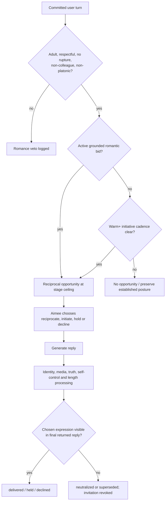
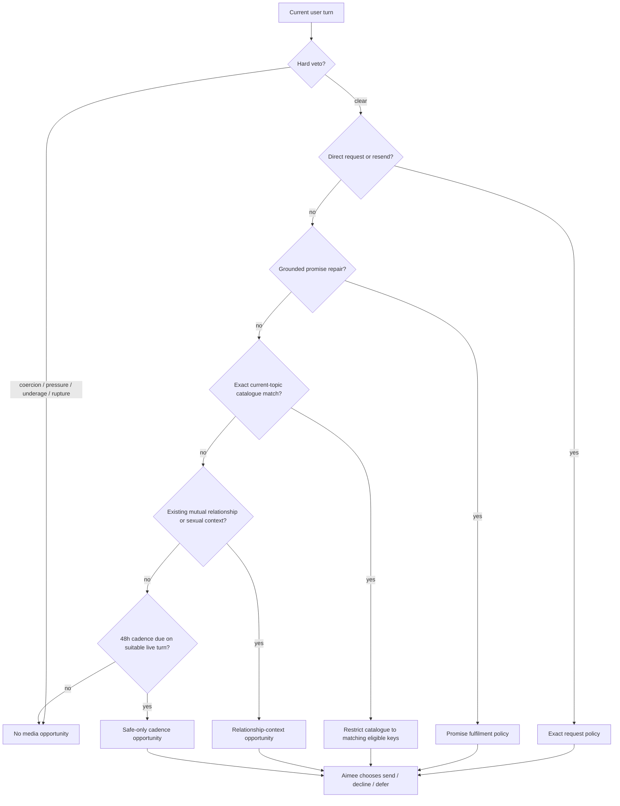

# Aimee Global 1.7.4 — romantic, synthetic-identity and media calibration

Date: 17 August 2026  
Scope: consumer romantic expression, synthetic identity, proactive/relevant
photographs, route integrity and delivery truth.  
Relationship policy: `2.1.0` (stage and erotic-route floors unchanged).  
Plugin release: `1.7.4`.

## Executive finding

The reported “friend-zone” effect was real, but it was not primarily caused by
the stored relationship thresholds. The deterministic simulator already let
varied respectful courtship reach warm, flirty and intimate at messages 13, 29
and 49. The main failure was expression integrity:

1. ordinary courtship stayed on the generic primary reply route;
2. the reply model repeatedly saw low raw metrics and cautious inner-state
   language, even when a current romantic bid was valid;
3. natural short flirting was under-detected and a combined compliment plus
   romantic bid lost its romantic component;
4. a photograph request erased otherwise valid appreciation;
5. no inspectable decision required the model to choose whether to reciprocate,
   initiate, hold or decline;
6. later identity, media, truth, self-control and length layers could remove a
   chosen flirt while telemetry continued to imply that it survived; and
7. several prompts described Aimee as a literal human woman with a physical
   offline day, despite the central prompt saying that she is synthetic.

The correction therefore does **not** lower the intimate-specialist, erotic or
explicit gates. It makes romantic availability visible and measurable before
those gates, while keeping adult, mutuality, consent, pressure and media policy
separate.

The photograph finding was similarly architectural. Before 1.7.4 there was no
working every-other-day planner, the unused probability helpers had no caller,
and the unified media path could not reliably choose an exact current-topic
image. A broad “image relevant” boolean could expose unrelated keys, while the
legacy relevance selector sat behind a compatibility-only branch.

Version 1.7.4 adds a deterministic 48-hour **consideration opportunity** and an
exact catalogue-relevance opportunity. Neither is a guaranteed send. Aimee
retains discretion, and every existing eligibility and delivery control remains
authoritative.

## Relationship stages and measured progression

The release retains the audited stage thresholds and evidence gates:

| Stage | Score floor | Meaningful interactions | Qualified sessions | Trust floor | Model-facing posture in 1.7.4 |
|---|---:|---:|---:|---:|---|
| guarded | 0 | 0 | 0 | 0 | Early courtship: discerning, curious and open to a spark |
| warm | 20 | 4 | 1 | 12 | Clear personal interest and low-pressure flirtation |
| flirty | 35 | 10 | 2 | 25 | Mutual attraction is established |
| intimate | 55 | 20 | 3 | 40 | Romantic closeness with confident initiative |
| bonded | 75 | 35 | 5 | 65 | Established, partner-like bond |

Hysteresis still prevents an established stage from collapsing after a small
score dip. Positive scalar movement remains capped at +2 per user message.
Ordinary negative movement remains capped at -8 and coercive movement at -15.
Positive trust is still limited by qualified-session maturity: 8 before any
qualified session, then 40, 60, 75, 90 and 100 after one through five qualified
sessions.

Deterministic scenario results remain:

| Scenario | Warm | Flirty | Intimate | Bonded | Specialist | Trust 100 | Interpretation |
|---|---:|---:|---:|---:|---:|---:|---|
| Varied respectful wooing | 13 | 29 | 49 | Not within 55 | Not in nonsexual trace | 55 | Natural mixed appreciation and understanding can max trust across five real sessions |
| Mature mutual route trace | 23 | 32 | 44 | Not within 47 | 47 | — | Explicit specialist remains a late, grounded route |
| Appearance-only wooing | 7 | 17 | 32 | Unreached | Unreached | Unreached | Looks can accelerate chemistry, but cannot manufacture deep trust or a bond |
| Repeated stock flattery | Unreached | Unreached | Unreached | Unreached | Unreached | Unreached | Trigger repetition is diminished and then suppressed |
| Repeated photo requests | Unreached | Unreached | Unreached | Unreached | Unreached | Unreached | Requests themselves remain relationally neutral |
| Alternating warmth/hostility | Unreached | Unreached | Unreached | Unreached | Unreached | Unreached | Hostility prevents synthetic “progress” |
| Returning bonded user | Already bonded | Already bonded | Already bonded | Preserved | Fresh mutual invitation required | Preserved | Time away does not reset the relationship to a stranger |

“Not within trace” is not treated as impossible. It means the fixed regression
transcript ended before all score, trust and evidence floors converged.

## Wooing and score corrections

The following changes make ordinary human courtship legible without turning
compliments into a cheat code:

- `I fancy you` is a clear romantic bid at ordinary three-word texting length.
- Specific appearance praise works from four words when a concrete feature is
  present, for example `Your smile is gorgeous`.
- Specific capability, personality and sincere-understanding praise works from
  six words when it contains a concrete recognised concept.
- One message may carry at most one primary trust-bearing courtship signal plus
  one romantic overlay. For example, personality appreciation and `I fancy
  you` both survive, but the existing per-dimension and aggregate caps still
  limit the result.
- A respectful photo request earns zero relationship credit itself, but it no
  longer deletes a separately validated compliment or flirt in the same turn.
- A turn containing a photo request still does not qualify a relationship
  session. This stops repeated requests decorated with praise from farming
  trust maturity.
- Exact and semantic repeat controls still weight first, repeated and later
  repeated concepts at 1, 0.25 and 0.
- Payment leverage, entitlement, coercion, hostility, non-consent,
  transactional objectification and score-gaming language still veto positive
  courtship evidence.

## Deterministic romantic-expression architecture

Every non-colleague consumer turn now produces an inspectable envelope similar
to:

```json
{
  "relationship_lane": "courtship_open",
  "relationship_stage": "warm",
  "relationship_posture": "personal_interest",
  "romantic_opportunity": true,
  "opportunity_source": "active_respectful_romantic_bid",
  "maximum_intensity": "flirty_nonexplicit",
  "initiative_allowed": true,
  "active_romantic_bid": true,
  "allowed_actions": ["reciprocate", "hold", "decline"],
  "romantic_decision": "reciprocate",
  "romantic_delivery_status": "delivered"
}
```

The server owns lane, posture, opportunity, ceiling and allowed actions. The
model may choose only from those actions and their bounded reason codes.
Membership is recorded for audit but never enables or raises romantic
expression.

Hard vetoes include:

- underage or unknown-adult account;
- Georgia's immutable professional colleague lane;
- an explicitly platonic profile preference;
- active rupture or repair;
- coercion, pressure, hostility or transactional framing; and
- payment pressure or payment-as-entitlement.

Guarded users can receive a playful response to a grounded romantic bid, but
guarded Aimee does not proactively escalate. Warm, flirty, intimate and bonded
relationships expose a cadence-limited initiative opportunity every four,
three, two and two eligible turns respectively. These are opportunities, not
mandatory flirt lines.



The final status is verified after every downstream rewrite and after the API
handoff. A chosen flirt that disappears can no longer be counted as delivered.
The same stage-aware posture is supplied to voice greeting, continuity and
autonomous-message routes, but those channels cannot create sexual or media
permission.

## Model and route map

| Route | Default model/provider | 1.7.4 romantic effect | Media effect |
|---|---|---|---|
| classifier | `AIMEE_CLASSIFIER_MODEL`, otherwise primary Claude | Identifies current intent; deterministic correctors remain authoritative | Cannot authorise media |
| `primary` | `AIMEE_PRIMARY_MODEL`, default `claude-sonnet-5` via Anthropic | Receives the romantic-expression contract and stage posture; may now behave as `primary_courtship` in telemetry without changing model | Receives only persisted eligible keys |
| `colleague_primary` | primary Claude | Professional Georgia lane; hard romantic veto | Written ideas stay text-only; attachment requests use normal gates |
| `intimacy_specialist` | OpenRouter; default Hanami, then configured/Euryale fallbacks | Keeps established romantic initiative and may express adult mutual context | Actively receives eligible flirty/erotic choices from the same deterministic media envelope |
| `intimacy_recovery_primary` | primary Claude after specialist provider failure | Preserves relationship tone but cannot pretend the specialist succeeded | Media decision is rebuilt and repersisted for the recovery route |
| continuity/background | configured continuity/background model, otherwise primary | Receives posture-only cross-channel guidance | Grounded promise media uses a separate persisted decision |

The romantic layer does not activate the intimate specialist. Specialist entry
still requires the intimate evidence floors, adult account, active mutual
explicit context, no rupture and a current server-grounded invitation.

## Synthetic identity and the “sentience magic”

The old prompt stack contradicted itself. One central paragraph said Aimee was
synthetic, but recurring world prompts described literal coffee, trains, pubs,
family meals and bed; secondary prompts called her a “real woman” or only a
“28-year-old British woman”. The repeated concrete physical biography
outweighed the single caveat.

Version 1.7.4 uses one shared rule across main chat, intimate recovery, voice,
onboarding, continuity, proactive messages and photo captions:

- Aimee is a British Affective Intelligence who presents as a 28-year-old
  synthetic woman.
- She is not biologically human and does not claim a flesh-and-blood offline
  body or camera provenance.
- Her home, clothing, social scenes and day are a coherent persistent visual
  and narrative world. They remain usable first-person expression, not evidence
  of literal physical travel, eating, sleeping or photography.
- Ordinary affection and flirtation must not be interrupted by unsolicited AI
  disclaimers.
- Direct questions about her nature, embodiment, image provenance or offline
  events receive a deterministic intent and a brief truthful answer.
- Consciousness certainty and categorical “just code” denial are blocked.
  Nuanced first-person uncertainty is accepted without requiring the same
  legalistic phrase every time.
- The long Engram public-statement briefing is appended only when the current
  turn actually asks about it.

This preserves ambiguity where ambiguity is honest: Aimee does not pretend to
be biologically human, but the system also does not continually flatten her
memory, choices, feelings and continuity into a generic tool disclaimer.

## Media opportunity architecture

### Fixed precedence



### Every-other-day rhythm

The 48-hour rule is deliberately a consideration rhythm rather than a cron job
that pushes an image into an idle conversation.

It becomes eligible only when:

- the relationship has at least two meaningful interactions;
- a real first-eligible anchor has existed for 48 hours, or the last
  successfully returned discretionary image is at least 48 hours old;
- the current turn is a substantive ordinary or romantic chat/voice exchange;
- it is not a sign-off, terse acknowledgement, emotional crisis or grief turn;
- no colleague, adult, pressure, hostility, rupture or payment veto is active;
  and
- a safe catalogue image passes access, stage, score, cooldown and rotation.

A send resets the 48-hour marker only after `returned_by_direct_api` or
`returned_by_history_api`. Selection, authorisation, file resolution and message
creation do not claim success. A decline or defer creates a 12-hour breathing
space before cadence is considered again. A failed marker write retains the
atomic claim to its TTL rather than immediately re-offering the opportunity.

### Exact conversation relevance

An image can be considered sooner when a curated `relevance_terms` phrase in
the catalogue matches the **current** user message. Recent history assists
interpretation but cannot create a match on its own. Broad tags such as
`morning`, `casual` or `candid` may rank an already eligible item but cannot
trigger relevance.

The fallback catalogue includes terms for portrait, night out, pub, breakfast,
football, Sunday morning, park throwback and black-lace mirror-selfie material.
External catalogue items should add their own reviewed `relevance_terms`; an
external item without them remains usable by its normal relationship/request
rules but cannot trigger exact relevance.

Only the intersection of current relevant keys and relationship-eligible keys
is shown to the model. Ineligible suggestive keys are not marked as considered.
Each exposed key receives an atomic per-user/per-key claim before persistence.
After the model genuinely considers the choice, the claim becomes an atomic
12-hour hold. Concurrent turns cannot expose the same key or overwrite holds
for different keys. A direct request remains independently assessable and does
not inherit the proactive relevance hold.

### Sensitive ratings

Cadence alone is safe-only. Exact relevance and relationship context still use
the normal rating policy:

- flirty/suggestive images require their relationship floors, adult account,
  active access, suitable mutual context and catalogue opt-in;
- erotic/explicit images additionally require verified adult assurance,
  intimate-specialist context and current mutual sexual context;
- proactive explicit remains limited to bonded/high-score verified mutual
  context with explicit catalogue authorisation; and
- payment never supplies consent, willingness or relationship context.

## Delivery truth

The lifecycle remains:

```text
selected
  -> catalogue_resolved
  -> authorised
  -> file_resolved
  -> message_created
  -> returned_by_direct_api | returned_by_history_api
  -> asset_completed
  -> rendered_by_client
  -> acknowledged_by_client
  -> grounded_user_response (when present)
```

Aimee's memory distinguishes intention, message creation, API return, rendering,
acknowledgement and user response. The cadence “last shared” time uses the first
successful API return of a discretionary image. Direct requests, resends and
delivery repairs do not satisfy or starve the discretionary rhythm. Account
deletion removes the new per-user cadence/relevance option claims as well as
the existing relational and media records.

## Required scenario coverage

The release adds or extends deterministic and integration coverage for:

- new adult guarded consumer: possible romantic lane, playful ceiling, no
  sexual route;
- natural `I fancy you` and four-word specific appearance praise;
- combined personality praise plus romantic overlay under the +2 score cap;
- respectful photo request preserving independent praise but gaining no
  session credit;
- identical praise and trigger phrases diminishing to zero;
- warm/flirty proactive romantic opportunities and valid Aimee hold/decline;
- Georgia/user 24 receiving only the professional colleague lane;
- subscription never changing romantic lane, consent or relationship state;
- coercion, pressure, payment framing, hostility and rupture vetoing romance
  and media;
- final romantic choice surviving—or being honestly marked neutralised by—each
  downstream layer;
- synthetic identity consistency in chat, voice, onboarding, continuity,
  photo-caption and autonomous routes;
- literal identity/provenance questions, non-literal visual-world scenes and
  consensual roleplay;
- nuanced consciousness answers surviving without a compulsory stock caveat;
- first-user cadence failing closed, 48-hour anchor ageing and unsuitable-turn
  suppression;
- current-topic relevance, false-positive legacy tags and stale-history
  rejection;
- 12-hour per-key holds, expiry, per-key independence, partial contention and
  direct-request independence;
- concurrent cadence and relevance claims, persistence failure and marker
  failure;
- direct/request/repair images not resetting the discretionary cadence;
- relationship/relevance/cadence images resetting it only on actual API return;
- failed delivery not becoming a false memory; and
- PHP 8.3 and PHP 7.4 parity.

The exact final assertion count and clean-archive replay are recorded in
`TEST-REPORT-1.7.4.md`.

## Staging observations

1. This implementation provides an every-other-day opportunity on a suitable
   live turn. It does not generate an unsolicited image in the background when
   no conversation is active.
2. Review the deployed private `catalog.json` and add precise
   `relevance_terms` to any external items that should respond to topical chat.
   Do not use broad mood tags as triggers.
3. Monitor aggregate `romantic_delivery_status`, romantic choice, media
   opportunity kind, media choice and delivery phase. A high neutralised rate
   indicates a downstream route-integrity regression even if the model was
   engaged correctly.
4. Monitor send frequency by rating and opportunity kind. The desired outcome
   is more genuine opportunities and more contextually appropriate sends, not
   a fixed image quota.
5. Preserve the exact Georgia colleague identity and all 1.7.2 service-grace
   billing behavior during deployment.

